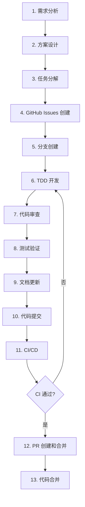

# 开发流程规范

> 📌 **本文档定义 WebGeoDB 的完整开发流程**

---

## 🎯 开发流程概览



---

## 1. 需求分析阶段

### 目标
- 明确功能需求和验收标准
- 识别技术风险和依赖关系
- 评估工作量和时间

### 输出
- 需求文档（简单功能可省略）
- 验收标准清单
- 技术风险评估

### 检查点
- [ ] 需求是否清晰明确？
- [ ] 是否有歧义或遗漏？
- [ ] 技术上是否可行？
- [ ] 是否有现成方案可复用？

---

## 2. 方案设计阶段

### 目标
- 设计技术方案和架构
- 选择合适的技术栈
- 确保向后兼容性

### 输出
- 技术方案文档（复杂功能）
- 接口设计（TypeScript 类型）
- 数据结构设计

### 设计原则
1. **简单优先**: 选择最简单的方案
2. **渐进增强**: 先实现核心功能
3. **向后兼容**: 不破坏现有 API
4. **性能考虑**: 评估性能影响

### 检查点
- [ ] 方案是否过度设计？
- [ ] 是否有现成库可用？
- [ ] 是否影响现有功能？
- [ ] 性能是否可接受？

---

## 3. 任务分解阶段

### 目标
- 将大功能分解为小任务
- 明确任务依赖关系
- 估算工作量和时间

### 方法
使用 WBS（工作分解结构）：
```
功能: SQL 查询支持
├── 1.1 SQL 解析器 (2天)
│   ├── 1.1.1 集成 node-sql-parser (0.5天)
│   ├── 1.1.2 实现 AST 转换 (1天)
│   └── 1.1.3 单元测试 (0.5天)
├── 1.2 查询转换器 (2天)
│   └── ...
└── 1.3 E2E 测试 (1天)
    └── ...
```

### 检查点
- [ ] 每个任务是否可独立完成？
- [ ] 任务大小是否合理（< 2天）？
- [ ] 依赖关系是否明确？
- [ ] 工作量估算是否合理？

---

## 4. GitHub Issues 创建阶段

### 目标
- 在 GitHub Issues 中记录需求或 Bug
- 明确类型、优先级、验收标准
- 指派开发者和里程碑

### Issue 类型

#### 功能需求 (Feature)
```markdown
## 类型: Feature
## 优先级: High/Medium/Low
## 复杂度: Small/Medium/Large

### 功能描述
实现 SQL 查询功能，支持 PostgreSQL/PostGIS 语法兼容。

### 验收标准
- [ ] 支持标准 SQL SELECT 语句
- [ ] 支持参数化查询
- [ ] 支持常见 PostGIS 函数
- [ ] 测试覆盖率 ≥ 80%
- [ ] 完整的文档和示例

### 技术方案
- 使用 node-sql-parser 解析 SQL
- 转换 AST 到 QueryBuilder
- 映射 PostGIS 函数

### 估算工作量
- SQL 解析器: 2 天
- AST 转换器: 2 天
- PostGIS 函数: 1 天
- 测试和文档: 1 天
- **总计**: 6 天

### 指派
@maintainer

### 里程碑
v1.0.0
```

#### Bug 报告 (Bug)
```markdown
## 类型: Bug
## 严重程度: Critical/High/Medium/Low

### 问题描述
测试文件中使用 `../../src` 导入路径导致模块找不到。

### 复现步骤
1. 创建测试文件 `test/sql/test.ts`
2. 使用 `import { WebGeoDB } from '../../src'`
3. 运行 `pnpm test`
4. 报错: 模块找不到

### 期望行为
应该使用 `import { WebGeoDB } from '../src'`

### 环境信息
- OS: macOS
- Browser: Chromium
- Node.js: v20

### 指派
@contributor
```

### Issue 创建检查清单
- [ ] Issue 类型明确 (Feature/Bug/Enhancement)
- [ ] 优先级设置正确
- [ ] 验收标准清晰
- [ ] 技术方案完整（功能需求）
- [ ] 估算工作量合理
- [ ] 已指派开发者
- [ ] 已设置里程碑

### 获取 Issue 编号
```bash
# 创建 Issue 后，GitHub 会分配编号
# 例如: #123 - feat(sql): implement SQL query support

# 在后续开发中引用此编号
git commit -m "feat(sql): implement SQL parser

Closes #123
"
```

---

## 5. 分支创建阶段

### 目标
- 为 Issue 创建对应的 Git 分支
- 遵循分支命名规范
- 关联 Issue 和分支

### 分支类型和命名

#### 功能分支 (feature/)
```bash
# 从 Issue #123 创建功能分支
git checkout main
git pull origin main
git checkout -b feature/sql-query-support

# 关联 Issue
# 在第一个 commit 中引用 Issue
git commit -m "feat(sql): initial setup

Closes #123
"
```

#### Bug 修复分支 (bugfix/)
```bash
# 从 Issue #456 创建修复分支
git checkout main
git pull origin main
git checkout -b bugfix/test-import-path-error

# 关联 Issue
git commit -m "fix(test): correct import path

Fixes #456
"
```

#### 紧急修复分支 (hotfix/)
```bash
# 生产环境紧急问题
git checkout main
git pull origin main
git checkout -b hotfix/security-vulnerability

# 标记为紧急
git commit -m "hotfix(security): patch critical issue

Critical production issue.
"
```

### 分支创建检查清单
- [ ] 从最新的 main 创建分支
- [ ] 分支命名符合规范
- [ ] 在第一个 commit 中关联 Issue
- [ ] 分支推送前运行测试
- [ ] 通知团队成员

### 分支管理命令
```bash
# 查看所有分支
git branch -a

# 查看当前分支
git branch --show-current

# 保持分支更新
git fetch origin main
git rebase origin/main

# 推送分支到远程
git push -u origin feature/xxx

# 删除已合并的本地分支
git branch -d feature/xxx

# 删除已合并的远程分支
git push origin --delete feature/xxx
```

---

## 6. TDD 开发阶段

### 4.1 Red（写失败的测试）
```typescript
// 1. 先写测试
it('should parse SQL SELECT statement', () => {
  const sql = 'SELECT * FROM features WHERE type = $1';
  const ast = parser.parse(sql);

  expect(ast.type).toBe('select');
  expect(ast.from).toBe('features');
});

// 2. 运行测试（应该失败）
// pnpm test → ❌ FAILED
```

### 4.2 Green（实现功能）
```typescript
// 3. 编写最小代码使测试通过
class SQLParser {
  parse(sql: string): AST {
    // 最简实现
    return {
      type: 'select',
      from: 'features'
    };
  }
}

// 4. 运行测试（应该通过）
// pnpm test → ✅ PASSED
```

### 4.3 Refactor（重构代码）
```typescript
// 5. 优化代码质量
class SQLParser {
  private parser: Parser;

  constructor() {
    this.parser = new Parser();
  }

  parse(sql: string): AST {
    const ast = this.parser.astify(sql, {
      database: 'PostgreSQL'
    });

    return this.normalizeAST(ast);
  }

  private normalizeAST(ast: any): AST {
    // 转换逻辑
  }
}

// 6. 确保测试仍然通过
// pnpm test → ✅ PASSED
```

### 检查点
- [ ] 是否遵循 TDD 流程？
- [ ] 测试是否覆盖核心功能？
- [ ] 测试是否覆盖边界情况？
- [ ] 代码是否易于理解？

---

## 7. 代码审查阶段

### 自我审查
使用 `.claude/docs/checklists/code-review.md`：
- [ ] 类型安全（无 any）
- [ ] 错误处理完整
- [ ] 测试覆盖充分
- [ ] 导入路径正确
- [ ] 文档完整

### 同伴审查
1. 创建 Pull Request
2. 填写 PR 模板
3. 至少一位审查者批准
4. 处理所有审查意见

### 检查点
- [ ] 是否完成自我审查？
- [ ] PR 描述是否清晰？
- [ ] 是否关联相关 Issue？
- [ ] CI 是否通过？

---

## 8. 测试验证阶段

### 本地测试
```bash
# 1. 单元测试
pnpm test

# 2. 覆盖率测试
pnpm test:coverage

# 3. 多浏览器测试
pnpm test:chrome
pnpm test:firefox
pnpm test:webkit

# 4. 构建测试
pnpm build
```

### 质量门禁
- ✅ 所有测试通过
- ✅ 覆盖率 ≥ 80%
- ✅ 无 TypeScript 错误
- ✅ 构建成功

### 检查点
- [ ] 所有测试是否通过？
- [ ] 覆盖率是否达标？
- [ ] 是否在所有浏览器中通过？
- [ ] 构建是否成功？

---

## 9. 文档更新阶段

### 代码文档
```typescript
/**
 * SQL 查询执行器
 *
 * @example
 * ```typescript
 * const results = await db.query(`
 *   SELECT * FROM features WHERE type = $1
 * `, ['restaurant']);
 * ```
 */
class SQLExecutor {
  // ...
}
```

### 用户文档
- [ ] 更新 `docs/api/reference.md`
- [ ] 更新 `docs/guides/` 相关指南
- [ ] 添加示例代码到 `examples/`
- [ ] 更新 `CHANGELOG.md`

### 开发文档
- [ ] 更新技术文档（如有新架构）
- [ ] 更新 `CLAUDE.md`（如有新规范）
- [ ] 记录已知问题

### 检查点
- [ ] 公共 API 是否有文档？
- [ ] 是否有使用示例？
- [ ] CHANGELOG 是否更新？
- [ ] 是否记录了破坏性变更？

---

## 10. 代码提交阶段

### Commit 格式
```bash
git commit -m "feat: 添加 SQL 查询支持

- 实现 SQL 解析器（基于 node-sql-parser）
- 实现 AST 到 QueryBuilder 的转换
- 添加 PostGIS 函数映射

Closes #123
"
```

### 提交检查
- [ ] Commit 信息清晰
- [ ] 使用约定式提交格式
- [ ] 包含相关 Issue 号
- [ ] 没有 WIP 提交

---

## 11. CI/CD 阶段

### CI 检查
```yaml
# .github/workflows/test.yml
name: Tests

on:
  push:
    branches: [main]
  pull_request:
    branches: [main]

jobs:
  test:
    runs-on: ubuntu-latest
    strategy:
      matrix:
        browser: [chromium, firefox, webkit]

    steps:
      - checkout
      - install dependencies
      - run tests
      - check coverage
```

### 质量门禁
- ✅ 所有浏览器测试通过
- ✅ 覆盖率 ≥ 80%
- ✅ 无 lint 错误
- ✅ 构建成功

### 检查点
- [ ] CI 是否通过？
- [ ] 所有浏览器是否测试？
- [ ] 覆盖率是否达标？

---

## 12. PR 创建和合并阶段

### 目标
- 创建 Pull Request
- 填写 PR 模板
- 关联 Issue
- 通过代码审查
- 合并到 main

### PR 创建流程

#### 1. 推送分支
```bash
# 确保所有提交已推送
git push origin feature/sql-query-support

# 如果有更新 main，先 rebase
git fetch origin main
git rebase origin/main
git push origin feature/sql-query-support --force-with-lease
```

#### 2. 创建 PR
```bash
# 在 GitHub 上创建 PR
# 或使用 gh CLI
gh pr create \
  --title "feat(sql): implement SQL query support" \
  --body "PR 描述见模板"
```

#### 3. PR 标题格式
```
<type>(<scope>): <subject>

示例:
feat(sql): implement SQL query support
fix(test): correct import path error
docs(api): update SQL query documentation
```

#### 4. PR 描述模板
```markdown
## 概述
<!-- 简短描述这个 PR 的目的 -->
实现 SQL 查询功能，支持 PostgreSQL/PostGIS 语法。

## 变更内容
### 新增
- SQL 解析器（基于 node-sql-parser）
- AST 到 QueryBuilder 转换器
- PostGIS 函数映射

### 修改
- 更新 query-builder.ts 支持转换

### 删除
- 无

## 测试
- [x] 单元测试通过 (15/15)
- [x] E2E 测试通过 (7/7)
- [x] 浏览器测试通过 (Chrome/Firefox/Safari)
- [x] 测试覆盖率: 85%

## 文档
- [x] API 文档已更新
- [x] 使用指南已更新
- [x] CHANGELOG 已更新
- [x] 示例代码已添加

## 破坏性变更
- [ ] 无破坏性变更

## Issues
Closes #123

## Checklist
- [x] 遵循代码规范
- [x] 测试覆盖率 ≥ 80%
- [x] 文档已更新
- [x] 所有浏览器测试通过
- [x] 自我审查完成
```

### PR 审查流程

#### 审查前检查
- [ ] CI 测试全部通过
- [ ] 测试覆盖率 ≥ 80%
- [ ] 无 TypeScript 错误
- [ ] 无 lint 错误
- [ ] 文档已更新
- [ ] 自我审查完成

#### 审查中
- [ ] 请求至少一位审查者
- [ ] 响应审查意见
- [ ] 修改反馈的问题
- [ ] 推送更新

#### 审查通过后
- [ ] 所有审查意见已处理
- [ ] CI 最终测试通过
- [ ] 准备合并

### PR 合并方式

#### Squash and Merge（推荐）
```bash
# 适用场景: 大多数功能分支
# 优点: 历史记录清晰
# 在 GitHub PR 页面选择 "Squash and merge"
```

#### Merge Commit（特殊情况）
```bash
# 适用场景: 大型功能或需要保留开发历史
# 在 GitHub PR 页面选择 "Merge commit"
```

### 合并后操作
```bash
# 1. 删除本地分支
git branch -d feature/sql-query-support

# 2. 删除远程分支
git push origin --delete feature/sql-query-support

# 3. 更新本地 main
git checkout main
git pull origin main

# 4. 关闭相关 Issue
# 如果 PR 使用 "Closes #123"，Issue 会自动关闭
```

### 检查点
- [ ] PR 标题是否清晰？
- [ ] PR 描述是否完整？
- [ ] 是否关联了 Issue？
- [ ] CI 是否通过？
- [ ] 审查是否通过？
- [ ] 文档是否更新？
- [ ] 合并后是否删除分支？
- [ ] Issue 是否关闭？

---

## 13. 代码合并阶段

### 合并前检查
- [ ] 所有审查意见已处理
- [ ] CI 测试全部通过
- [ ] 文档已更新
- [ ] 无合并冲突

### 合并方式
- 使用 Squash and Merge
- 删除功能分支
- 保留有意义的历史记录

### 合并后
- [ ] 验证线上构建
- [ ] 更新版本号（如需要）
- [ ] 发布 Release Notes
- [ ] 通知团队

---

## 🚨 常见陷阱

### ❌ 跳过测试
```
"我先写代码，后补测试"  // ❌
"测试太简单，不需要"    // ❌
"CI 失败了，但我本地通过" // ❌
```

### ❌ 忽略文档
```
"代码自解释，不需要文档" // ❌
"文档以后再补"         // ❌
"CHANGELOG 忘了更新"   // ❌
```

### ❌ 违反规范
```
"这次特殊情况，可以违反" // ❌
"规范太严格了"         // ❌
"我习惯这样写"         // ❌
```

---

## ✅ 最佳实践

### 1. 渐进式开发
```
MVP → 功能完善 → 性能优化 → 文档补全
```

### 2. 持续集成
```
小步快跑，频繁提交，及时发现问题
```

### 3. 代码审查
```
所有代码必须经过审查，包括自己的
```

### 4. 文档同步
```
代码和文档同步更新，不积累技术债务
```

---

## 📊 效率指标

### 开发效率
- **任务完成率**: 计划任务 / 实际完成
- **时间准确度**: 估算时间 / 实际时间
- **返工率**: 修复 bug 时间 / 开发时间

### 质量指标
- **测试覆盖率**: ≥ 80%
- **Bug 密度**: < 1 bug / 1000 行代码
- **代码审查通过率**: ≥ 95%

### 流程指标
- **CI 通过率**: ≥ 95%
- **平均审查时间**: < 24 小时
- **平均合并时间**: < 48 小时

---

**记住**: 遵循流程是质量的保障，不是效率的障碍！
