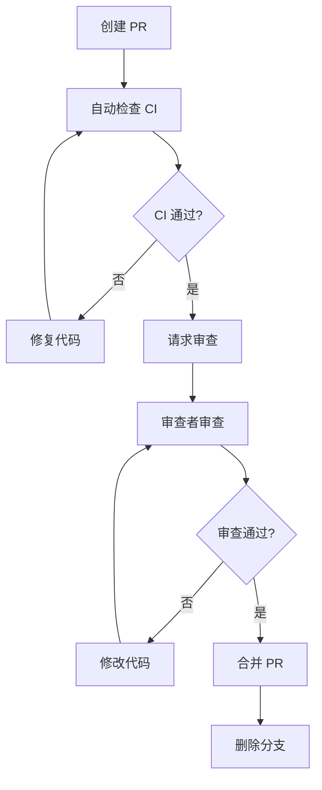

# Git 工作流规范

> 📌 **本文档定义 WebGeoDB 项目的 Git 分支、Issues 和 PR 工作流**

---

## 🎯 分支策略

### 分支类型

```
main (保护分支)
  ├─ feature/xxx (功能分支)
  ├─ bugfix/xxx (Bug 修复分支)
  ├─ hotfix/xxx (紧急修复分支)
  └─ release/x.x.x (发布分支)
```

### 分支命名规范

#### 1. 功能分支 (feature/)
```bash
feature/sql-query-support
feature/spatial-index-optimization
feature/user-authentication
```

**规则**:
- 前缀: `feature/`
- 命名: kebab-case (短横线命名)
- 描述: 简洁描述功能内容
- 长度: < 50 字符

#### 2. Bug 修复分支 (bugfix/)
```bash
bugfix/test-import-path-error
bugfix/database-closed-error
bugfix/sql-field-extraction
```

**规则**:
- 前缀: `bugfix/`
- 命名: kebab-case
- 描述: 描述修复的 Bug
- 关联: 必须关联 Issue

#### 3. 紧急修复分支 (hotfix/)
```bash
hotfix/critical-security-fix
hotfix/production-crash
```

**规则**:
- 前缀: `hotfix/`
- 使用场景: 生产环境紧急问题
- 优先级: 最高，立即处理
- 审查: 至少 2 位维护者审查

#### 4. 发布分支 (release/)
```bash
release/1.0.0
release/1.1.0
```

**规则**:
- 前缀: `release/`
- 命名: 语义化版本号
- 用途: 准备发布
- 合并: 只合并 bugfix，不合并 feature

---

## 📋 GitHub Issues 管理

### Issue 类型

#### 1. 功能需求 (Feature)
```markdown
## 类型: Feature
## 优先级: High/Medium/Low
## 复杂度: Small/Medium/Large

### 功能描述
实现 SQL 查询功能，支持 PostgreSQL/PostGIS 语法兼容。

### 验收标准
- [ ] 支持标准 SQL SELECT 语句
- [ ] 支持参数化查询
- [ ] 支持常见 PostGIS 函数
- [ ] 测试覆盖率 ≥ 80%
- [ ] 完整的文档和示例

### 技术方案
- 使用 node-sql-parser 解析 SQL
- 转换 AST 到 QueryBuilder
- 映射 PostGIS 函数

### 估算工作量
- SQL 解析器: 2 天
- AST 转换器: 2 天
- PostGIS 函数: 1 天
- 测试和文档: 1 天
- **总计**: 6 天

### 依赖关系
- 无

### 指派
@maintainer

### 里程碑
v1.0.0
```

#### 2. Bug 报告 (Bug)
```markdown
## 类型: Bug
## 严重程度: Critical/High/Medium/Low
## 影响范围: All/Chrome/Firefox/Safari

### 问题描述
测试文件中使用 `../../src` 导入路径导致模块找不到。

### 复现步骤
1. 创建测试文件 `test/sql/test.ts`
2. 使用 `import { WebGeoDB } from '../../src'`
3. 运行 `pnpm test`
4. 报错: 模块找不到

### 期望行为
应该使用 `import { WebGeoDB } from '../src'`

### 实际行为
导入路径错误，导致测试失败

### 环境信息
- OS: macOS
- Browser: Chromium
- Node.js: v20
- Package version: 0.1.0

### 附加信息
错误日志：
```
Error: Cannot find module '../../src'
```

### 指派
@contributor
```

#### 3. 改进建议 (Enhancement)
```markdown
## 类型: Enhancement

### 建议内容
添加查询结果缓存功能，提升重复查询性能。

### 当前问题
每次查询都要重新执行，没有缓存机制。

### 建议方案
- 使用 LRU 缓存
- 支持手动失效
- 自动智能失效

### 收益
- 减少 50% 的重复查询时间
- 提升 UX

### 优先级
Medium

### 指派
@maintainer
```

### Issue 模板

```yaml
# Issue Template

## 类型
- [ ] Feature (功能需求)
- [ ] Bug (Bug 报告)
- [ ] Enhancement (改进建议)
- [ ] Documentation (文档)
- [ ] Performance (性能)

## 优先级
- [ ] Critical (严重)
- [ ] High (高)
- [ ] Medium (中)
- [ ] Low (低)

## 问题描述
<!-- 详细描述问题或需求 -->

## 验收标准
- [ ] 标准 1
- [ ] 标准 2
- [ ] 标准 3

## 技术方案
<!-- 技术实现方案 -->

## 估算工作量
<!-- 预估时间和工作量 -->

## 依赖关系
<!-- 相关 Issue 或 PR -->

## 指派
@username

## 里程碑
v1.0.0
```

---

## 🔄 Git 工作流程

### 场景 1: 开发新功能

```bash
# 1. 从 Issue 创建分支
# Issue #123: 添加 SQL 查询支持
git checkout main
git pull origin main
git checkout -b feature/sql-query-support

# 2. 关联 Issue
# 在分支的第一个 commit 中引用 Issue
git commit -m "feat(sql): implement SQL parser

Closes #123
"

# 3. 开发过程
# 遵循 TDD 流程
git add .
git commit -m "feat(sql): add AST to QueryBuilder converter

Refs #123
"

# 4. 完成开发
git add .
git commit -m "feat(sql): complete SQL query support

- Implement SQL parser (node-sql-parser)
- Implement AST to QueryBuilder converter
- Add PostGIS function mapping
- Add tests (22/22 passing)
- Add documentation

Closes #123
"

# 5. 推送分支
git push -u origin feature/sql-query-support

# 6. 创建 PR
# PR 标题: feat(sql): implement SQL query support
# PR 描述:
#   ## 概述
#   实现 SQL 查询功能，支持 PostgreSQL/PostGIS 语法。
#
#   ## 变更
#   - 添加 SQL 解析器
#   - 添加查询转换器
#   - 添加 PostGIS 函数映射
#
#   ## 测试
#   - ✅ 单元测试: 15/15 通过
#   - ✅ E2E 测试: 7/7 通过
#   - ✅ 覆盖率: 85%
#
#   ## 文档
#   - ✅ API 文档已更新
#   - ✅ 使用指南已添加
#
#   ## Issues
#   Closes #123
#
#   ## Checklist
#   - [x] 遵循代码规范
#   - [x] 测试覆盖率 ≥ 80%
#   - [x] 文档已更新
#   - [x] 所有浏览器测试通过
```

### 场景 2: 修复 Bug

```bash
# 1. 从 Issue 创建分支
# Issue #456: 修复测试导入路径错误
git checkout main
git pull origin main
git checkout -b bugfix/test-import-path-error

# 2. 修复 Bug
git add .
git commit -m "fix(test): correct import path in test files

- Change import from '../../src' to '../src'
- Fix in boundary-conditions.test.ts
- All tests now pass (22/22)

Fixes #456
"

# 3. 推送并创建 PR
git push -u origin bugfix/test-import-path-error

# PR 标题: fix(test): correct import path error
# PR 描述:
#   ## 问题
#   测试文件中使用了错误的导入路径 `../../src`，应该是 `../src`。
#
#   ## 修复
#   - 修正 boundary-conditions.test.ts 导入路径
#   - 添加 afterEach 导入
#
#   ## 测试
#   - ✅ 所有测试通过
#
#   Fixes #456
```

### 场景 3: 紧急修复

```bash
# 1. 从 main 创建 hotfix 分支
git checkout main
git pull origin main
git checkout -b hotfix/security-vulnerability

# 2. 快速修复
git add .
git commit -m "hotfix(security): patch critical security issue

- Fix SQL injection vulnerability
- Add parameter validation

Critical issue, needs immediate release.
"

# 3. 推送并创建 PR（标记为紧急）
git push -u origin hotfix/security-vulnerability

# PR 标题: [URGENT] hotfix(security): patch critical vulnerability
# PR 描述:
#   ## 紧急修复
#   生产环境发现严重安全漏洞，需要立即修复。
#
#   ## 修复内容
#   - 修复 SQL 注入漏洞
#   - 添加参数验证
#
#   ## 影响范围
#   - 所有使用 SQL 查询的用户
#
#   ## 测试
#   - ✅ 安全测试通过
#   - ✅ 回归测试通过
#
#   ## 审核
#   需要 @maintainer1 和 @maintainer2 审核通过
```

---

## 🔀 Pull Request 规范

### PR 标题格式

```
<type>(<scope>): <subject>

<body>
```

**Type 类型**:
- `feat`: 新功能
- `fix`: Bug 修复
- `refactor`: 代码重构
- `docs`: 文档更新
- `test`: 测试相关
- `chore`: 构建/工具
- `perf`: 性能优化
- `ci`: CI 相关

**示例**:
```
feat(sql): implement SQL query support
fix(test): correct import path error
docs(api): update SQL query documentation
refactor(spatial): optimize spatial index
```

### PR 描述模板

```markdown
## 概述
<!-- 简短描述这个 PR 的目的 -->

## 变更内容
<!-- 列出主要的变更 -->

### 新增
- 功能 1
- 功能 2

### 修改
- 修改 1
- 修改 2

### 删除
- 删除 1

## 测试
<!-- 描述测试情况 -->
- [ ] 单元测试通过
- [ ] 集成测试通过
- [ ] 浏览器测试通过 (Chrome/Firefox/Safari)
- [ ] 测试覆盖率: xx%

## 文档
<!-- 描述文档更新情况 -->
- [ ] API 文档已更新
- [ ] 使用指南已更新
- [ ] CHANGELOG 已更新
- [ ] 示例代码已添加

## 破坏性变更
<!-- 如果有破坏性变更，必须说明 -->
- [ ] 无破坏性变更
- [ ] 有破坏性变更: 描述变更和迁移指南

## Issues
<!-- 关联的 Issue -->
Closes #123
Fixes #456
Refs #789

## Checklist
<!-- 完成检查清单 -->
- [x] 遵循代码规范
- [x] 测试覆盖率 ≥ 80%
- [x] 文档已更新
- [x] 所有浏览器测试通过
- [x] 无 TypeScript 错误
- [x] 无 lint 错误
- [x] 自我审查完成

## 截图/演示
<!-- 如果适用，添加截图或演示 -->


## 其他
<!-- 其他需要说明的内容 -->
```

### PR 审查流程



### PR 审查标准

#### 必须满足（阻塞项）
- ✅ 所有 CI 测试通过
- ✅ 测试覆盖率 ≥ 80%
- ✅ 无 TypeScript 类型错误
- ✅ 无 lint 错误
- ✅ 文档已更新（如需要）
- ✅ 至少一位审查者批准

#### 建议满足（非阻塞）
- ⚠️ 代码风格一致
- ⚠️ 性能无明显影响
- ⚠️ 添加了充分的注释
- ⚠️ 有性能测试数据

### PR 合并方式

#### Squash and Merge（推荐）
```bash
# 适用场景: 大多数功能分支
# 优点: 历史记录清晰，保持 main 分支整洁
# 操作: GitHub PR 页面选择 "Squash and merge"
```

#### Merge Commit（特殊情况）
```bash
# 适用场景: 大型功能或需要保留开发历史
# 缺点: 历史记录较复杂
# 操作: GitHub PR 页面选择 "Merge commit"
```

#### Rebase and Merge（不推荐）
```bash
# 不推荐使用，容易导致历史混乱
```

---

## 📊 Issues 与 PR 关联

### Issue 生命周期

```
1. Open (新建)
   ↓
2. In Progress (开发中)
   - 指派给开发者
   - 关联功能分支
   ↓
3. In Review (审查中)
   - PR 已创建
   - 等待审查
   ↓
4. Ready for Merge (待合并)
   - 审查通过
   - CI 通过
   ↓
5. Closed (已完成)
   - PR 已合并
   - Issue 关闭
```

### Issue 与 PR 关联命令

```bash
# 关闭 Issue
Closes #123
Fixes #456
Resolves #789

# 引用 Issue（不关闭）
Refs #123
Related to #456
```

### PR 中关联多个 Issues

```markdown
## Issues
Closes #123 (SQL 查询支持)
Closes #456 (PostGIS 函数映射)
Related to #789 (查询优化)
```

---

## 🔒 分支保护规则

### main 分支保护

```yaml
# GitHub Settings → Branches
Branch: main

✅ 受保护
✅ 需要 PR 才能推送
✅ 需要审查批准
  - 至少 1 位审查者
  - 包括维护者
✅ 需要状态检查通过
  - CI/tests (必需)
  - CI/lint (必需)
✅ 限制谁可以推送
  - 维护者
✅ 限制谁可以强制推送
  - 维护者
✅ 要求分支是最新的
  - 必须先 rebase main
```

---

## 📝 分支管理最佳实践

### ✅ 推荐做法

```bash
# 1. 频繁提交，小步快跑
git commit -m "feat: add SQL parser"
git commit -m "feat: add AST converter"
git commit -m "test: add unit tests"
git commit -m "docs: update documentation"

# 2. 保持分支更新
git fetch origin main
git rebase origin/main

# 3. 分支命名清晰
feature/sql-query-support  ✅
feature/branch1          ❌

# 4. 及时清理已合并分支
git branch -d feature/sql-query-support
git push origin --delete feature/sql-query-support

# 5. 使用有意义 commit 信息
git commit -m "feat(sql): implement SQL parser
- Support SELECT statements
- Support WHERE clauses
- Add unit tests
Closes #123"
```

### ❌ 避免做法

```bash
# 1. 不要直接在 main 提交
git checkout main  # ❌
git commit -m "some change"

# 2. 不要创建无意义分支
feature/xxx-test  # ❌
feature/work     # ❌

# 3. 不要积压大量提交不推送
# 工作了一周都不推送  # ❌

# 4. 不要在分支上使用 merge commit
git merge main  # ❌ 应该用 rebase

# 5. 不要创建巨大的 PR
# 一个 PR 包含 100+ 个文件修改  # ❌

# 6. 不要忽略 CI 失败
# CI 失败了还继续推送  # ❌
```

---

## 🎯 工作流程清单

### 功能开发
```
□ 创建 Issue (功能需求)
□ 讨论方案
□ 指派开发者
□ 从 main 创建功能分支
  git checkout -b feature/xxx
□ 开发功能 (TDD)
□ 频繁提交
□ 保持分支更新 (rebase main)
□ 运行本地测试
  pnpm test
□ 创建 PR
□ 填写 PR 模板
□ 关联 Issue
□ 等待审查
□ 修改反馈
□ CI 通过
□ 合并 PR
□ 删除功能分支
□ 关闭 Issue
```

### Bug 修复
```
□ 创建 Issue (Bug 报告)
□ 复现问题
□ 分析根因
□ 制定修复方案
□ 创建修复分支
  git checkout -b bugfix/xxx
□ 修复问题
□ 添加回归测试
□ 运行所有测试
□ 创建 PR
□ 描述修复方案
□ 关联 Issue
□ 审查通过
□ 合并 PR
□ 验证修复
□ 关闭 Issue
```

### 紧急修复
```
□ 确认紧急程度
□ 创建 hotfix 分支
  git checkout -b hotfix/xxx
□ 快速修复
□ 最小化测试
□ 创建 PR (标记紧急)
□ 至少 2 位维护者审查
□ 立即合并
□ 准备发布
□ 关闭 Issue
```

---

## 📚 参考资料

- [GitHub Flow](https://guides.github.com/introduction/flow/)
- [Git Flow](https://nvie.com/posts/a-successful-git-branching-model/)
- [Conventional Commits](https://www.conventionalcommits.org/)
- [GitHub Issues](https://guides.github.com/features/issues/)

---

**记住**: 良好的 Git 工作流是团队协作的基础！
