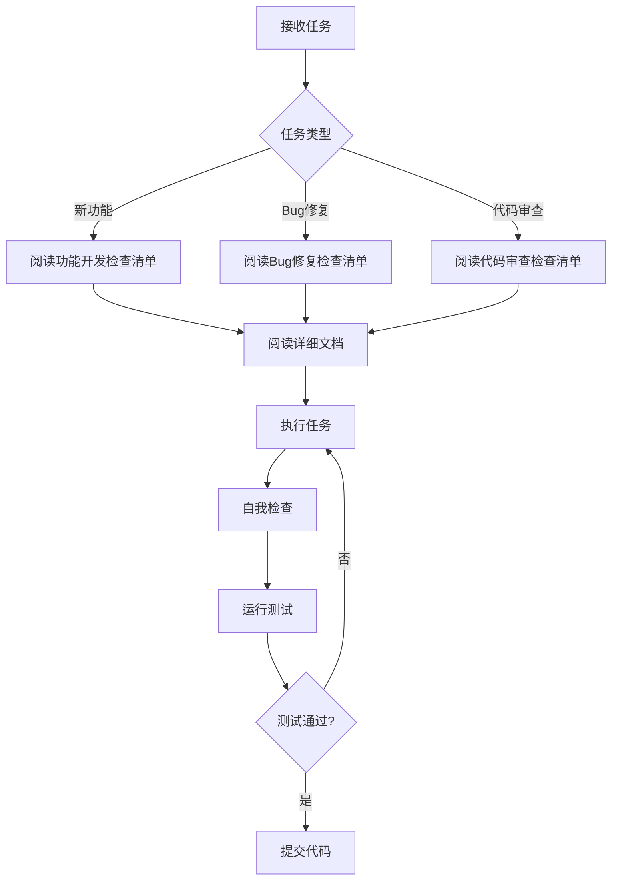

# WebGeoDB 项目规范（核心版）

> 📌 **本文档是 Claude AI 辅助开发的核心规范，始终加载到上下文中。**
> 📚 **详细文档位于 `.claude/docs/` 目录，按需读取。**

---

## 🎯 项目定位

WebGeoDB 是一个**轻量级 Web 端空间数据库**，核心特点：
- **场景**: 浏览器端离线空间数据存储和查询
- **存储**: IndexedDB (通过 Dexie.js)
- **查询**: 链式 API + SQL/PostGIS 兼容
- **目标**: < 300KB (当前 ~184KB)
- **技术栈**: TypeScript + Vitest + Playwright

---

## ⚠️ 不可违背的规则

### 1. 测试文件导入路径（最常见错误！）
```typescript
// ✅ 正确 - test/ 目录下所有测试文件
import { WebGeoDB } from '../src';  // test/ 与 src/ 是同级目录

// ❌ 错误 - 常见错误
import { WebGeoDB } from '../../src';  // 层级错误
```

### 2. SQL 参数占位符
```typescript
// ✅ 使用 PostgreSQL 风格
await db.query('SELECT * FROM features WHERE type = $1', ['restaurant']);

// ❌ 避免 ? 风格（虽兼容但不推荐）
await db.query('SELECT * FROM features WHERE type = ?', ['restaurant']);
```

### 3. 异步清理（避免 DatabaseClosedError）
```typescript
// ✅ 正确
afterEach(async () => {
  if (db) {
    await db.close();  // 必须 await
  }
});

// ❌ 错误 - 导致测试失败
afterEach(() => {
  db.close();  // 缺少 await
});
```

### 4. 变量命名检查
```typescript
// ❌ 常见拼写错误
expect(cafas.length).toBe(50);  // 应该是 cafes

// ✅ 使用 TypeScript 类型检查避免
const cafes: Cafe[] = await getCafes();
expect(cafes.length).toBe(50);
```

---

## 🚀 快速命令

### 开发
```bash
# 安装依赖
pnpm install

# 启动开发模式
pnpm dev

# 构建
pnpm build
```

### 测试
```bash
# 运行所有测试
pnpm test

# 特定浏览器
pnpm test:chrome   # Chromium
pnpm test:firefox  # Firefox
pnpm test:webkit   # WebKit

# 特定测试文件
pnpm test -- test/sql/sql-parser.test.ts

# 测试覆盖率
pnpm test:coverage
```

### 代码质量
```bash
# 类型检查
npx tsc --noEmit

# 代码检查
pnpm lint

# 格式化
npx prettier --write .
```

---

## 📂 项目结构

```
webgeodb/
├── packages/core/
│   ├── src/              # 源代码
│   │   ├── sql/          # SQL 模块
│   │   ├── query/        # 查询构建器
│   │   ├── spatial/      # 空间引擎
│   │   ├── storage/      # 存储层
│   │   └── index/        # 空间索引
│   └── test/             # 测试文件
├── .claude/
│   ├── CLAUDE.md         # 本文件（核心规范）
│   └── docs/             # 详细文档
│       ├── development-workflow.md
│       ├── coding-standards.md
│       ├── testing-standards.md
│       ├── sql-standards.md
│       ├── troubleshooting.md
│       └── checklists/
│           ├── feature-development.md
│           ├── bug-fix.md
│           └── code-review.md
└── docs/                 # 项目文档
```

---

## 🔧 常见问题速查

### 测试失败

| 错误 | 原因 | 解决方案 |
|------|------|---------|
| `DatabaseClosedError` | 异步清理问题 | `afterEach` 中使用 `await db.close()` |
| `module not found` | 导入路径错误 | 测试文件使用 `../src` 而非 `../../src` |
| `cafas is not defined` | 变量拼写错误 | 检查变量名拼写 |
| 测试超时 | 异步操作未等待 | 添加 `await` 或增加超时时间 |

### SQL 问题

| 错误 | 原因 | 解决方案 |
|------|------|---------|
| `table.where(...).equals is not a function` | 字段名是对象 | 检查 `query-translator.ts` 中的字段提取逻辑 |
| LIMIT/OFFSET 错误 | node-sql-parser 嵌套结构 | 检查 `seperator === 'offset'` 处理 |
| require is not defined | 浏览器环境使用 require | 使用 `import` 替代 `require` |

---

## 📋 必读文档清单

根据任务类型，必须先阅读对应的详细文档：

### 🎯 新功能开发
**必须阅读**: `.claude/docs/checklists/feature-development.md`

**核心步骤**:
1. ✅ 方案设计（技术选型、架构设计）
2. ✅ 任务分解（WBS、依赖关系）
3. ✅ 开发实现（TDD、代码规范）
4. ✅ 代码审查（自检清单）
5. ✅ 单元测试（覆盖率 > 80%）
6. ✅ 文档更新（API 文档、示例）
7. ✅ 代码提交（Commit 格式、CI 通过）

### 🐛 Bug 修复
**必须阅读**: `.claude/docs/checklists/bug-fix.md`

**核心步骤**:
1. ✅ 问题定位（日志、调试）
2. ✅ 根因分析（为什么发生）
3. ✅ 修复方案（最小改动）
4. ✅ 回归测试（确保不引入新问题）
5. ✅ 文档更新（如有必要）

### 🔍 代码审查
**必须阅读**: `.claude/docs/checklists/code-review.md`

**审查要点**:
- [ ] 类型安全（无 any）
- [ ] 错误处理（try-catch）
- [ ] 测试覆盖（> 80%）
- [ ] 导入路径（test/ 用 `../src`）
- [ ] SQL 语法（PostgreSQL 风格）

---

## 🎓 学习路径

### 新人入门
1. 阅读 `README.md`（项目概览）
2. 阅读 `.claude/docs/development-workflow.md`（开发流程）
3. 运行 `pnpm test`（熟悉测试）
4. 阅读示例代码 `examples/`

### 功能开发
1. 阅读 `.claude/docs/checklists/feature-development.md`
2. 阅读相关模块的详细文档
3. 遵循 TDD 开发模式
4. 执行代码审查清单

### 问题排查
1. 阅读 `.claude/docs/troubleshooting.md`
2. 检查常见问题速查表
3. 查看相关 Issue
4. 提交新 Issue（附上详细信息）

---

## 🔄 工作流程速览



---

## 📞 获取帮助

- **文档**: `.claude/docs/` 目录
- **Issues**: https://github.com/webgeodb/webgeodb/issues
- **Discussions**: https://github.com/webgeodb/webgeodb/discussions

---

## 📝 更新日志

- **2025-03-11**: 创建核心规范，基于最近的测试问题和 SQL 实现经验
- **下次更新**: 根据新问题和 CI 失败持续改进

---

**记住**: 当不确定时，先阅读 `.claude/docs/` 中的详细文档！
