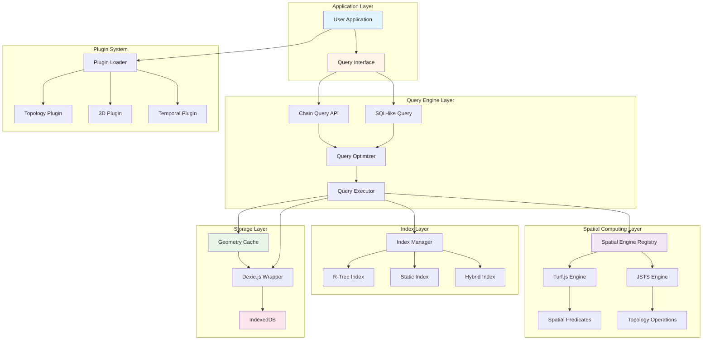

# WebGeoDB Overall Architecture

## Description

This architecture diagram illustrates WebGeoDB's layered structure and modular design:

- **Application Layer**: User application code interacting with the database through query interfaces
- **Query Engine Layer**: Provides both chain query and SQL-like APIs with optimizer and executor
- **Spatial Computing Layer**: Supports multiple spatial engines (Turf.js, JSTS) providing predicates and topology operations
- **Index Layer**: Manages various spatial indexes (R-Tree, Static, Hybrid) for query optimization
- **Storage Layer**: IndexedDB-based persistent storage with geometry caching
- **Plugin System**: Extensible plugin architecture for additional features

## Key Flows

### Query Execution Flow
1. Application initiates query through API
2. Query optimizer selects optimal execution plan
3. Query executor coordinates all layers to complete query
4. Utilizes indexes to accelerate data retrieval
5. Uses cache to reduce redundant computations
6. Results returned to application

### Data Write Flow
1. Application executes insert/update operation
2. Geometry data written to cache
3. Update related indexes
4. Persist to IndexedDB
5. Transaction commit confirmation
