# Spatial Engine System Architecture

```mermaid
graph TB
    subgraph "Engine Interface Layer"
        INTERFACE[ISpatialEngine Spatial Engine Interface]
        METHODS["Base Methods:
- supports(geometryType)
- calculateDistance(geom1, geom2)
- calculateBuffer(geometry, distance)
- calculateBbox(geometry)"]
    end

    subgraph "Engine Registry"
        REGISTRY[EngineRegistry]
        REGISTER["Register Methods:
- registerEngine(engine)
- getEngine(operation)
- getBestEngine(geometry)"]
        PRIORITY[Priority Queue]
    end

    subgraph "Turf.js Engine"
        TURF_IMPL[TurfEngine Implementation]
        TURF_FEATURES["Supported Features:
- Point, LineString, Polygon
- distance, buffer, bbox
- area, length, centroid
- Basic topology"]
        TURF_PROS["Advantages:
- Lightweight ~200KB
- Excellent performance
- Complete features"]
        TURF_CONS["Limitations:
- No complex topology
- No projection"]
    end

    subgraph "JSTS Engine"
        JSTS_IMPL[JSTSEngine Implementation]
        JSTS_FEATURES["Supported Features:
- Precise topology operations
- union, intersection, difference
- Spatial predicate validation
- Advanced geometry operations"]
        JSTS_PROS["Advantages:
- JTS port, complete features
- Complex topology support"]
        JSTS_CONS["Limitations:
- Larger size ~500KB
- Lazy loading"]
    end

    subgraph "Spatial Predicates System"
        PRED_REG[PredicateRegistry]
        OPT_PRED[OptimizedPredicates]
        ADV_PRED[AdvancedPredicates]
        PREDICATES["8 OGC Predicates:
- intersects
- contains
- within
- equals
- disjoint
- crosses
- touches
- overlaps"]
    end

    subgraph "Topology Operations System"
        BUF[OptimizedBuffer]
        DIST[OptimizedDistance]
        BUF_CACHE["Buffer Cache:
- Cache common results
- Reduce redundant calc"]
        DIST_CACHE["Distance Cache:
- Cache distance results
- Batch query optimization"]
    end

    subgraph "Geometry Cache System"
        CACHE[GeometryCache]
        LRU[LRU Cache Strategy]
        CACHE_STATS["Cache Stats:
- Hit rate monitoring
- Auto cleanup"]
    end

    INTERFACE --> TURF_IMPL
    INTERFACE --> JSTS_IMPL
    TURF_IMPL --> TURF_FEATURES
    JSTS_IMPL --> JSTS_FEATURES

    REGISTRY --> PRIORITY
    REGISTRY --> TURF_IMPL
    REGISTRY --> JSTS_IMPL

    PRED_REG --> OPT_PRED
    PRED_REG --> ADV_PRED
    OPT_PRED --> PREDICATES
    ADV_PRED --> PREDICATES

    BUF --> BUF_CACHE
    DIST --> DIST_CACHE

    CACHE --> LRU
    CACHE --> CACHE_STATS

    style INTERFACE fill:#e1f5ff
    style REGISTRY fill:#fff4e6
    style TURF_IMPL fill:#e8f5e9
    style JSTS_IMPL fill:#f3e5f5
    style CACHE fill:#fce4ec
```



## Description

The spatial engine system is the core computing module of WebGeoDB, designed with plugin and strategy patterns:

- **Engine Interface Layer**: Defines unified spatial engine interface ensuring engine replaceability
- **Engine Registry**: Manages multiple spatial engines, selecting optimal engine based on operation and geometry type
- **Turf.js Engine**: Default engine providing lightweight, high-performance basic spatial calculations
- **JSTS Engine**: Advanced engine providing precise topology operations and complex geometry processing
- **Spatial Predicates System**: Implements 8 OGC standard spatial predicates with optimized and advanced versions
- **Topology Operations System**: Provides buffer, distance and other topology operations with result caching
- **Geometry Cache System**: LRU cache strategy reducing redundant calculations and improving performance

## Engine Selection Strategy

### Automatic Selection
```typescript
// Simple distance calculation - auto select Turf.js
db.distance(point1, point2) // → TurfEngine

// Complex topology - auto select JSTS
db.intersect(polygon1, polygon2) // → JSTSEngine
```

### Manual Selection
```typescript
// Force specific engine
db.withEngine('jsts').union(geom1, geom2)
```

## Performance Optimization Points

1. **Cache Strategy**: Cache frequently used geometries and calculation results
2. **Engine Selection**: Automatically select optimal engine based on operation complexity
3. **Batch Operations**: Reuse engine instances during batch queries
4. **Lazy Loading**: Large engines like JSTS loaded on demand
