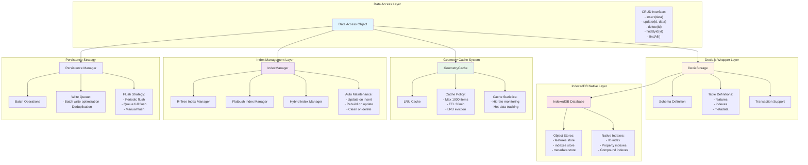

# Storage Layer Architecture



## Description

The storage layer is WebGeoDB's data persistence foundation, designed with layers for performance and reliability:

- **Data Access Layer**: Provides unified CRUD interface encapsulating all data access logic
- **Dexie.js Wrapper Layer**: Wraps IndexedDB with Dexie.js providing friendly API and transaction support
- **IndexedDB Native Layer**: Browser native storage engine providing persistence capability
- **Geometry Cache System**: LRU cache strategy caching frequently used geometries reducing IndexedDB access
- **Index Management Layer**: Manages creation, update, and deletion of spatial indexes maintaining consistency
- **Persistence Strategy**: Batch write, queue management, flush strategy optimizing write performance

## Data Write Flow

### Insert Operation
```typescript
// 1. Application calls insert
await db.features.insert(feature)

// 2. Write to geometry cache
cache.set(id, geometry)

// 3. Update spatial index
indexManager.insert(id, bbox)

// 4. Persist to IndexedDB
await dexie.table('features').add(feature)

// 5. Commit transaction
transaction.commit()
```

### Update Operation
```typescript
// 1. Application calls update
await db.features.update(id, newData)

// 2. Update geometry cache
cache.update(id, newGeometry)

// 3. Rebuild spatial index
indexManager.update(id, oldBbox, newBbox)

// 4. Persist to IndexedDB
await dexie.table('features').put(id, newData)

// 5. Commit transaction
transaction.commit()
```

## Query Optimization Strategy

1. **Cache First**: Prioritize reading from cache
2. **Index Acceleration**: Use spatial indexes to quickly locate candidate sets
3. **Batch Prefetch**: Prefetch related data reducing IO operations
4. **Lazy Loading**: Load large objects on demand
5. **Result Set Caching**: Cache query results reducing redundant calculations
