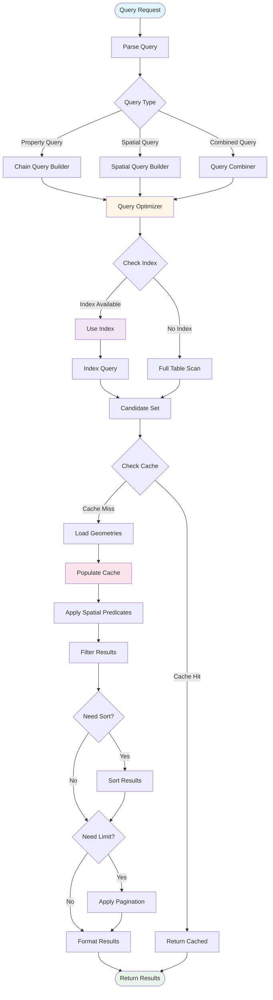

# Query Engine Flow



## Description

The query engine is WebGeoDB's core functional module responsible for processing all query requests and returning results:

#### Query Processing Stages

1. **Query Parsing**: Parse query request, identify query type
   - Property Query: Condition-based queries on property fields
   - Spatial Query: Geometry relation-based spatial queries
   - Combined Query: Combination of property and spatial conditions

2. **Query Optimization**: Analyze query and select optimal execution plan
   - Evaluate available indexes
   - Select optimal index strategy
   - Optimize query order

3. **Index Utilization**: Use spatial indexes to accelerate queries
   - R-Tree Index: Suitable for dynamic data
   - Static Index: Suitable for static data
   - Hybrid Index: Balance performance and flexibility

4. **Cache Management**: Reduce redundant calculations
   - Check if cache hits
   - Populate cache for subsequent use
   - LRU eviction strategy

5. **Predicate Application**: Apply spatial predicates for filtering
   - OGC standard spatial predicates
   - Optimized versions for performance
   - Precise geometric calculations

6. **Result Processing**: Sort, paginate, format
   - Multi-field sort support
   - Flexible pagination mechanism
   - Standardized output format

## Query Optimization Tips

### 1. Use Indexes
```typescript
// Create index
await db.features.createIndex('geometry', 'rtree')

// Query will automatically use index
const results = await db.features
  .distance('geometry', [116.4, 39.9], '<', 1000)
  .toArray()
```

### 2. Use Cache Effectively
```typescript
// Warm up cache
await db.features.loadGeometries(ids)

// Subsequent queries will hit cache
const cached = await db.features.findById(id)
```

### 3. Limit Result Set
```typescript
// Always use limit
const results = await db.features
  .where('type', '=', 'poi')
  .limit(100)  // Limit result count
  .toArray()
```

### 4. Choose Optimal Query Order
```typescript
// Filter before compute
const results = await db.features
  .where('type', '=', 'poi')        // Property filter first
  .where('rating', '>', 4)          // Continue filtering
  .distance('geometry', center, '<', 1000)  // Spatial query last
  .toArray()
```
