# CRUD Operations Data Flow

```mermaid
flowchart TB
    subgraph "CREATE Operation"
        C_START([Insert Request]) --> C_VALIDATE[Data Validation]
        C_VALIDATE --> C_CHECK{Valid?}
        C_CHECK -->|No| C_ERROR([Return Error])
        C_CHECK -->|Yes| C_CACHE[Write to Cache]
        C_CACHE --> C_INDEX[Update Index]
        C_INDEX --> C_IDB[Write to IndexedDB]
        C_IDB --> C_TRANS{Transaction OK?}
        C_TRANS -->|No| C_ROLL[Rollback]
        C_TRANS -->|Yes| C_SUCCESS([Return Success])
        C_ROLL --> C_ERROR
    end

    subgraph "READ Operation"
        R_START([Query Request]) --> R_CHECK_CACHE{Check Cache}
        R_CHECK_CACHE -->|Hit| R_RETURN_CACHE([Return Cached])
        R_CHECK_CACHE -->|Miss| R_INDEX{Use Index?}
        R_INDEX -->|Yes| R_INDEX_QUERY[Index Query]
        R_INDEX -->|No| R_FULL_SCAN[Full Scan]
        R_INDEX_QUERY --> R_CANDIDATES[Candidates]
        R_FULL_SCAN --> R_CANDIDATES
        R_CANDIDATES --> R_LOAD[Load Geometries]
        R_LOAD --> R_FILTER[Apply Predicates]
        R_FILTER --> R_CACHE_FILL[Fill Cache]
        R_CACHE_FILL --> R_RETURN([Return Results])
    end

    subgraph "UPDATE Operation"
        U_START([Update Request]) --> U_VALIDATE[Data Validation]
        U_VALIDATE --> U_CHECK{Valid?}
        U_CHECK -->|No| U_ERROR([Return Error])
        U_CHECK -->|Yes| U_OLD_CACHE[Update Cache]
        U_OLD_CACHE --> U_OLD_INDEX[Update Index]
        U_OLD_INDEX --> U_IDB[Update IndexedDB]
        U_IDB --> U_TRANS{Transaction OK?}
        U_TRANS -->|No| U_ROLL[Rollback]
        U_TRANS -->|Yes| U_SUCCESS([Return Success])
        U_ROLL --> U_ERROR
    end

    subgraph "DELETE Operation"
        D_START([Delete Request]) --> D_VALIDATE[Validate ID]
        D_VALIDATE --> D_CHECK{Exists?}
        D_CHECK -->|No| D_ERROR([Return Error])
        D_CHECK -->|Yes| D_CACHE[Clear Cache]
        D_CACHE --> D_INDEX[Clear Index]
        D_INDEX --> D_IDB[Delete from IndexedDB]
        D_IDB --> D_TRANS{Transaction OK?}
        D_TRANS -->|No| D_ROLL[Rollback]
        D_TRANS -->|Yes| D_SUCCESS([Return Success])
        D_ROLL --> D_ERROR
    end

    style C_START fill:#e8f5e9
    style R_START fill:#e1f5ff
    style U_START fill:#fff4e6
    style D_START fill:#fce4ec
    style C_SUCCESS fill:#c8e6c9
    style R_RETURN fill:#bbdefb
    style U_SUCCESS fill:#ffe0b2
    style D_SUCCESS fill:#f8bbd9
    style C_ERROR fill:#ffcdd2
    style U_ERROR fill:#ffcdd2
    style D_ERROR fill:#ffcdd2
```



## Description

CRUD operations are the most basic functions of a database. This diagram shows the complete data flow of four basic operations in WebGeoDB:

#### CREATE
1. **Data Validation**: Validate input data integrity and legitimacy
2. **Write to Cache**: Write geometry data to LRU cache
3. **Update Index**: Update all related spatial indexes
4. **Persist**: Write data to IndexedDB
5. **Transaction Management**: Ensure operation atomicity, rollback on failure

#### READ
1. **Cache Check**: Prioritize reading data from cache
2. **Index Query**: Use spatial index to quickly locate candidate set
3. **Data Load**: Load complete data from IndexedDB
4. **Predicate Filter**: Apply spatial predicates for precise filtering
5. **Cache Fill**: Populate results to cache for subsequent use

#### UPDATE
1. **Data Validation**: Validate update data legitimacy
2. **Cache Update**: Update or delete old data in cache
3. **Index Rebuild**: Update spatial index to reflect new data
4. **Persist Update**: Update data in IndexedDB
5. **Transaction Management**: Ensure update operation consistency

#### DELETE
1. **ID Validation**: Validate if record to delete exists
2. **Cache Clear**: Delete related data from cache
3. **Index Clear**: Delete entries from spatial index
4. **Persist Delete**: Delete data from IndexedDB
5. **Transaction Management**: Ensure delete operation consistency

## Best Practices

### 1. Use Batch Operations
```typescript
// ❌ Bad: Multiple single inserts
for (const feature of features) {
  await db.features.insert(feature)
}

// ✅ Good: Batch insert
await db.features.insertMany(features)
```

### 2. Transaction Control
```typescript
// Use transactions to ensure consistency
await db.transaction('rw', db.features, async () => {
  await db.features.insert(feature1)
  await db.features.insert(feature2)
  // Both operations succeed or both fail
})
```

### 3. Error Handling
```typescript
try {
  await db.features.insert(feature)
} catch (error) {
  // Handle validation errors, transaction errors, etc.
  console.error('Insert failed:', error)
}
```

### 4. Cache Warming
```typescript
// Pre-load frequently used data to cache
const frequentlyUsed = await db.features
  .where('type', '=', 'poi')
  .limit(100)
  .toArray()

// Subsequent queries will hit cache
```
