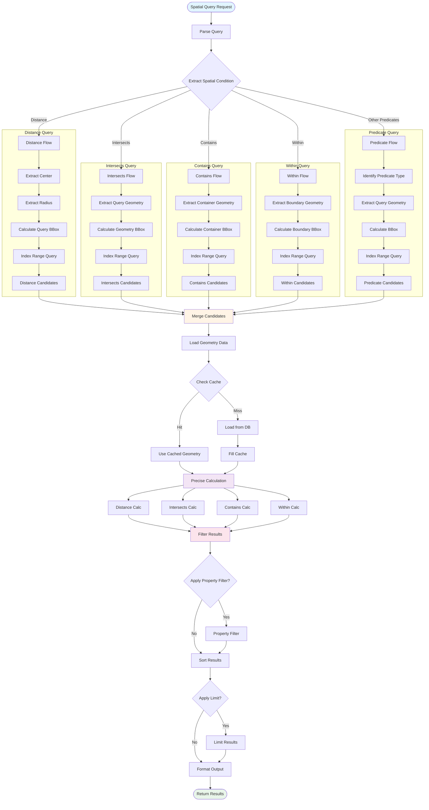

# Spatial Query Execution Flow



## Description

Spatial query is the core function of WebGeoDB. This diagram shows the complete execution flow of spatial queries:

#### Query Types

1. **Distance Query**: Find geographic objects within specified radius
   - Extract center point and radius
   - Calculate query bounding box
   - Use index for fast filtering

2. **Intersects Query**: Find objects intersecting with specified geometry
   - Extract query geometry
   - Calculate geometry bounding box
   - Index range query

3. **Contains Query**: Find objects completely containing specified geometry
   - Extract container geometry
   - Index and precise verification

4. **Within Query**: Find objects completely within specified geometry
   - Extract boundary geometry
   - Reverse direction of contains judgment

#### Execution Stages

1. **Index Filter**: Use R-Tree index to quickly narrow candidate set
2. **Candidate Merge**: Merge candidate sets from multiple spatial conditions
3. **Precise Calculation**: Perform precise geometry calculations on candidate set
4. **Cache Utilization**: Cache geometry objects to reduce redundant loading
5. **Result Filter**: Apply property conditions and sorting pagination

## Performance Optimization Points

### 1. Index First
```typescript
// ✅ Create spatial index
await db.features.createIndex('geometry', 'rtree')

// Query will automatically use index
const results = await db.features
  .intersects('geometry', queryPolygon)
  .toArray()
```

### 2. BBox Pre-filtering
```typescript
// First use BBox for fast filtering
const bbox = turf.bbox(queryPolygon)
const candidates = await db.features
  .where('geometry', 'within', bbox)
  .toArray()

// Then precise calculation
const results = candidates.filter(f =>
  turf.intersects(f.geometry, queryPolygon)
)
```

### 3. Batch Query Optimization
```typescript
// Batch distance queries
const points = await db.features.toArray()
const distances = await Promise.all(
  points.map(p => db.distance(p.geometry, center))
)
```

### 4. Cache Warming
```typescript
// Pre-load area data to cache
const areaData = await db.features
  .within('geometry', area)
  .toArray()

// Subsequent queries will be faster
```
