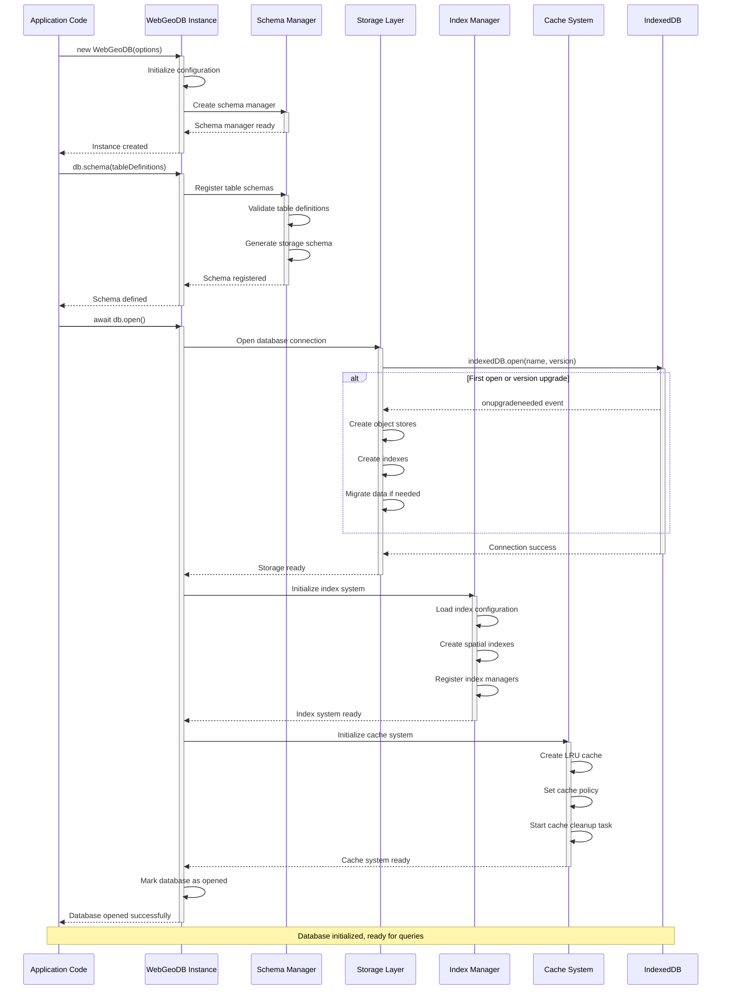

# Database Initialization Sequence Diagram



## Description

This sequence diagram shows the complete initialization flow of WebGeoDB database:

#### Initialization Stages

1. **Instance Creation (new WebGeoDB)**
   - Create database instance
   - Initialize internal configuration
   - Create schema manager

2. **Schema Definition (schema)**
   - Register table structure definitions
   - Validate table definitions
   - Generate IndexedDB storage schema

3. **Database Open (open)**
   - Open IndexedDB connection
   - Handle version upgrade (if needed)
   - Create object stores and indexes
   - Initialize index system
   - Initialize cache system

#### Key Components

- **Schema Manager**: Manages table structures and field definitions
- **Storage Layer**: Encapsulates IndexedDB operations
- **Index Manager**: Manages creation and maintenance of spatial indexes
- **Cache System**: Provides LRU cache functionality

## Initialization Code Example

### Complete Initialization Flow
```typescript
// 1. Create instance
const db = new WebGeoDB({
  name: 'my-geo-database',
  version: 1
})

// 2. Define schema
db.schema({
  features: {
    id: 'string',
    name: 'string',
    type: 'string',
    geometry: 'geometry',
    properties: 'json'
  },
  locations: {
    id: 'string',
    timestamp: 'number',
    coordinates: 'geometry'
  }
})

// 3. Open database
try {
  await db.open()
  console.log('Database initialized successfully')
} catch (error) {
  console.error('Failed to initialize database:', error)
}
```

### Version Upgrade Handling
```typescript
// Data automatically migrated on version upgrade
db.schema({
  features: {
    id: 'string',
    name: 'string',
    type: 'string',
    geometry: 'geometry',
    properties: 'json',
    // New fields
    createdAt: 'number',
    updatedAt: 'number'
  }
})

// Increment version
const db = new WebGeoDB({
  name: 'my-geo-database',
  version: 2  // Version upgrade
})
```

## Best Practices

1. **Error Handling**: Always wrap initialization code with try-catch
2. **Version Management**: Increment version number when upgrading schema
3. **Lazy Loading**: Only open database when needed
4. **Resource Cleanup**: Close database connection after use
