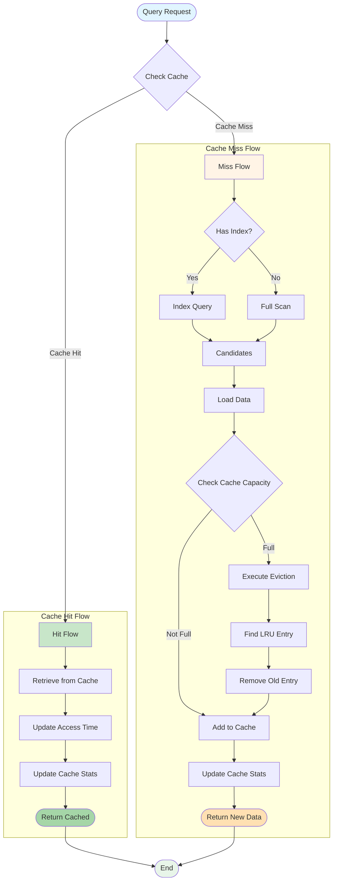

# Cache Hit/Miss Flow



## Description

This diagram shows the complete workflow of WebGeoDB cache system, including both cache hit and miss handling logic:

#### Cache Hit Flow

1. **Retrieve Cache**: Quickly get data from LRU cache
2. **Update Access Time**: Update last access time to prevent eviction
3. **Update Statistics**: Increment cache hit count for hit rate calculation
4. **Return Result**: Return cached data directly without database access

**Advantage**: Extremely fast response (microsecond level), reduce database access

#### Cache Miss Flow

1. **Index Query**: Use spatial index to quickly locate candidate data
2. **Data Load**: Load complete data from IndexedDB
3. **Capacity Check**: Check if cache has reached maximum capacity
4. **Direct Add**: If cache not full, directly add new data
5. **LRU Eviction**: If cache full, execute LRU eviction strategy
   - Find least recently used entry
   - Remove that entry
   - Add new data
6. **Update Statistics**: Increment cache miss count

**Advantage**: Automatically manage cache size, retain hot data

## Cache Optimization Tips

### 1. Cache Warming
```typescript
// Warm up cache on app startup
async function warmupCache() {
  const hotData = await db.features
    .where('type', '=', 'poi')
    .limit(100)
    .toArray()

  console.log('Cache warmed with', hotData.length, 'items')
}
```

### 2. Cache Cleanup
```typescript
// Manually clear cache
await db.clearCache()

// Or invalidate specific entry
await db.invalidateCache('feature-id-123')
```

### 3. Cache Size Tuning
```typescript
// Adjust cache size based on memory
const cacheSize = navigator.deviceMemory >= 8 ? 2000 : 500

const db = new WebGeoDB({
  name: 'my-db',
  cache: {
    maxSize: cacheSize  // Dynamic adjustment
  }
})
```

### 4. Monitor Cache Hit Rate
```typescript
// Periodically check cache performance
setInterval(async () => {
  const stats = await db.getCacheStats()
  if (stats.hitRate < 0.7) {
    console.warn('Cache hit rate low:', stats.hitRate)
    // Consider increasing cache size or optimizing queries
  }
}, 60000)  // Check every minute
```
