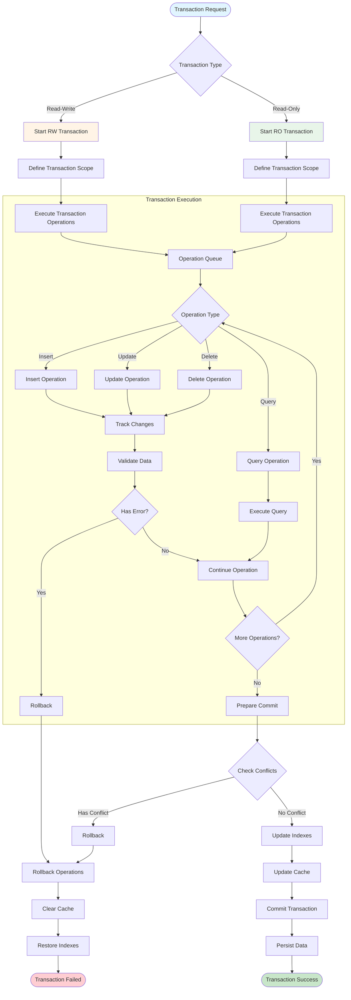

# Transaction Processing Flow



## Description

This diagram shows the complete transaction processing flow in WebGeoDB, including transaction start, execution, commit, and rollback:

#### Transaction Types

1. **Read-Write Transaction**
   - Allows insert, update, delete operations
   - Requires exclusive access to related tables
   - Supports full transaction isolation

2. **Read-Only Transaction**
   - Only allows query operations
   - Can execute concurrently
   - Faster execution speed

#### Transaction Execution Stages

1. **Define Scope**: Specify tables involved in transaction
2. **Operation Queue**: Collect all database operations
3. **Data Validation**: Validate operation validity
4. **Conflict Detection**: Check for conflicting operations
5. **Index Update**: Update all related indexes
6. **Cache Update**: Update or clear cache
7. **Data Persistence**: Commit to IndexedDB

#### Transaction Rollback

When encountering errors or conflicts:
1. **Rollback Operations**: Undo all executed operations
2. **Clear Cache**: Clear related cache data
3. **Restore Indexes**: Restore indexes to previous state
4. **Return Error**: Report failure to caller

## Transaction Usage Examples

### 1. Basic Transaction
```typescript
// Read-write transaction
await db.transaction('rw', db.features, async () => {
  // All operations in same transaction
  await db.features.insert(feature1)
  await db.features.insert(feature2)
  await db.features.update(id3, updates)

  // Any error will cause rollback
})

// Read-only transaction
const results = await db.transaction('r', db.features, async () => {
  return await db.features.where('type', '=', 'poi').toArray()
})
```

### 2. Cross-Table Transaction
```typescript
// Transaction involving multiple tables
await db.transaction(
  'rw',
  [db.features, db.locations, db.metadata],
  async () => {
    await db.features.insert(feature)
    await db.locations.insert(location)
    await db.metadata.update('count', { value: count + 1 })

    // All succeed or all rollback
  }
)
```

### 3. Error Handling
```typescript
try {
  await db.transaction('rw', db.features, async () => {
    await db.features.insert(feature1)
    await db.features.insert(feature2)

    // If error thrown here, both inserts will rollback
    throw new Error('Something went wrong')
  })
} catch (error) {
  console.error('Transaction failed, all changes rolled back:', error)
}
```

### 4. Nested Transactions
```typescript
// Outer transaction
await db.transaction('rw', db.features, async () => {
  await db.features.insert(feature1)

  // Inner transaction (actually same transaction)
  await db.transaction('rw', db.locations, async () => {
    await db.locations.insert(location1)
  })

  // All operations in same transaction
})
```

## Transaction Best Practices

1. **Keep Short**: Transactions should be as short as possible to reduce lock time
2. **Error Handling**: Always use try-catch to handle transaction errors
3. **Avoid Nesting**: Try to avoid deeply nested transactions
4. **Read-Only Optimization**: Use read-only transactions for queries to improve performance
5. **Batch Operations**: Put related operations in the same transaction
