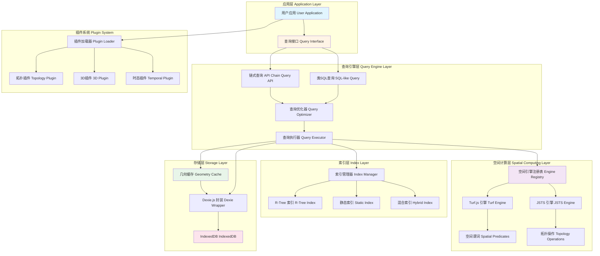

# WebGeoDB 整体架构 / Overall Architecture

## 图表说明 Description

### 中文说明

这个架构图展示了 WebGeoDB 的分层结构和模块化设计：

- **应用层**: 用户的应用代码，通过查询接口与数据库交互
- **查询引擎层**: 提供链式查询和类SQL两种API，包含查询优化器和执行器
- **空间计算层**: 支持多种空间引擎（Turf.js、JSTS），提供空间谓词和拓扑操作
- **索引层**: 管理多种空间索引（R-Tree、静态索引、混合索引）以优化查询性能
- **存储层**: 基于IndexedDB的持久化存储，包含几何缓存机制
- **插件系统**: 支持扩展功能的插件架构

### English Description

This architecture diagram illustrates WebGeoDB's layered structure and modular design:

- **Application Layer**: User application code interacting with the database through query interfaces
- **Query Engine Layer**: Provides both chain query and SQL-like APIs with optimizer and executor
- **Spatial Computing Layer**: Supports multiple spatial engines (Turf.js, JSTS) providing predicates and topology operations
- **Index Layer**: Manages various spatial indexes (R-Tree, Static, Hybrid) for query optimization
- **Storage Layer**: IndexedDB-based persistent storage with geometry caching
- **Plugin System**: Extensible plugin architecture for additional features

## 关键流程 Key Flows

### 查询执行流程 Query Execution Flow
1. 应用通过API发起查询
2. 查询优化器选择最优执行计划
3. 查询执行器协调各层完成查询
4. 利用索引加速数据检索
5. 使用缓存减少重复计算
6. 结果返回给应用

### 数据写入流程 Data Write Flow
1. 应用执行插入/更新操作
2. 几何数据写入缓存
3. 更新相关索引
4. 持久化到IndexedDB
5. 事务提交确认
