# 空间引擎系统架构 / Spatial Engine System Architecture

```mermaid
graph TB
    subgraph "引擎接口层 Engine Interface Layer"
        INTERFACE[ISpatialEngine Spatial Engine Interface]
        METHODS["基础方法 Base Methods:
- supports(geometryType)
- calculateDistance(geom1, geom2)
- calculateBuffer(geometry, distance)
- calculateBbox(geometry)"]
    end

    subgraph "引擎注册表 Engine Registry"
        REGISTRY[EngineRegistry 引擎注册表]
        REGISTER["注册方法 Register Methods:
- registerEngine(engine)
- getEngine(operation)
- getBestEngine(geometry)"]
        PRIORITY[优先级队列 Priority Queue]
    end

    subgraph "Turf.js 引擎 Turf.js Engine"
        TURF_IMPL[TurfEngine 实现]
        TURF_FEATURES["支持功能 Supported Features:
- Point, LineString, Polygon
- distance, buffer, bbox
- area, length, centroid
- 基础拓扑操作"]
        TURF_PROS["优势 Advantages:
- 轻量级 ~200KB
- 性能优秀
- 功能完整"]
        TURF_CONS["限制 Limitations:
- 无复杂拓扑
- 无坐标转换"]
    end

    subgraph "JSTS 引擎 JSTS Engine"
        JSTS_IMPL[JSTSEngine 实现]
        JSTS_FEATURES["支持功能 Supported Features:
- 精确拓扑操作
- union, intersection, difference
- 空间谓词验证
- 高级几何操作"]
        JSTS_PROS["优势 Advantages:
- JTS移植，功能完整
- 支持复杂拓扑"]
        JSTS_CONS["限制 Limitations:
- 体积较大 ~500KB
- 按需加载"]
    end

    subgraph "空间谓词系统 Spatial Predicates System"
        PRED_REG[PredicateRegistry 谓词注册表]
        OPT_PRED[OptimizedPredicates 优化谓词]
        ADV_PRED[AdvancedPredicates 高级谓词]
        PREDICATES["8个OGC谓词 8 OGC Predicates:
- intersects 相交
- contains 包含
- within 在内部
- equals 相等
- disjoint 分离
- crosses 交叉
- touches 接触
- overlaps 重叠"]
    end

    subgraph "拓扑操作系统 Topology Operations System"
        BUF[OptimizedBuffer 优化缓冲]
        DIST[OptimizedDistance 优化距离]
        BUF_CACHE["缓冲缓存 Buffer Cache:
- 缓存常见缓冲结果
- 减少重复计算"]
        DIST_CACHE["距离缓存 Distance Cache:
- 缓存距离计算结果
- 批量查询优化"]
    end

    subgraph "几何缓存系统 Geometry Cache System"
        CACHE[GeometryCache 几何缓存]
        LRU[LRU缓存策略 LRU Strategy]
        CACHE_STATS["缓存统计 Cache Stats:
- 命中率监控
- 自动清理"]
    end

    INTERFACE --> TURF_IMPL
    INTERFACE --> JSTS_IMPL
    TURF_IMPL --> TURF_FEATURES
    JSTS_IMPL --> JSTS_FEATURES

    REGISTRY --> PRIORITY
    REGISTRY --> TURF_IMPL
    REGISTRY --> JSTS_IMPL

    PRED_REG --> OPT_PRED
    PRED_REG --> ADV_PRED
    OPT_PRED --> PREDICATES
    ADV_PRED --> PREDICATES

    BUF --> BUF_CACHE
    DIST --> DIST_CACHE

    CACHE --> LRU
    CACHE --> CACHE_STATS

    style INTERFACE fill:#e1f5ff
    style REGISTRY fill:#fff4e6
    style TURF_IMPL fill:#e8f5e9
    style JSTS_IMPL fill:#f3e5f5
    style CACHE fill:#fce4ec
```



## 图表说明 Description

### 中文说明

空间引擎系统是 WebGeoDB 的核心计算模块，采用插件化和策略模式设计：

- **引擎接口层**: 定义统一的空间引擎接口，确保不同引擎的可替换性
- **引擎注册表**: 管理多个空间引擎，根据操作类型和几何类型选择最佳引擎
- **Turf.js 引擎**: 默认引擎，提供轻量级、高性能的基础空间计算
- **JSTS 引擎**: 高级引擎，提供精确的拓扑操作和复杂几何处理
- **空间谓词系统**: 实现8个OGC标准空间谓词，支持优化和高级版本
- **拓扑操作系统**: 提供缓冲、距离等拓扑操作，包含结果缓存优化
- **几何缓存系统**: LRU缓存策略，减少重复计算，提升性能

### English Description

The spatial engine system is the core computing module of WebGeoDB, designed with plugin and strategy patterns:

- **Engine Interface Layer**: Defines unified spatial engine interface ensuring engine replaceability
- **Engine Registry**: Manages multiple spatial engines, selecting optimal engine based on operation and geometry type
- **Turf.js Engine**: Default engine providing lightweight, high-performance basic spatial calculations
- **JSTS Engine**: Advanced engine providing precise topology operations and complex geometry processing
- **Spatial Predicates System**: Implements 8 OGC standard spatial predicates with optimized and advanced versions
- **Topology Operations System**: Provides buffer, distance and other topology operations with result caching
- **Geometry Cache System**: LRU cache strategy reducing redundant calculations and improving performance

## 引擎选择策略 Engine Selection Strategy

### 自动选择 Automatic Selection
```typescript
// 简单距离计算 - 自动选择 Turf.js
db.distance(point1, point2) // → TurfEngine

// 复杂拓扑操作 - 自动选择 JSTS
db.intersect(polygon1, polygon2) // → JSTSEngine
```

### 手动指定 Manual Selection
```typescript
// 强制使用特定引擎
db.withEngine('jsts').union(geom1, geom2)
```

## 性能优化要点 Performance Optimization Points

1. **缓存策略**: 缓存常用几何对象和计算结果
2. **引擎选择**: 根据操作复杂度自动选择最优引擎
3. **批量操作**: 批量查询时复用引擎实例
4. **懒加载**: JSTS等大体积引擎按需加载
