# 存储层架构 / Storage Layer Architecture

```mermaid
graph TB
    subgraph "数据访问层 Data Access Layer"
        DAO[Data Access Object 数据访问对象]
        CRUD["CRUD接口 CRUD Interface:
- insert(data) 插入
- update(id, data) 更新
- delete(id) 删除
- findById(id) 根据ID查找
- findAll() 查找所有"]
    end

    subgraph "Dexie.js 封装层 Dexie.js Wrapper Layer"
        DEXIE[DexieStorage Dexie存储]
        SCHEMA[Schema Definition 模式定义]
        TABLES["表定义 Table Definitions:
- features 要素表
- indexes 索引表
- metadata 元数据表"]
        TRANS[Transaction Support 事务支持]
    end

    subgraph "IndexedDB 原生层 IndexedDB Native Layer"
        IDB[IndexedDB Database]
        STORES["对象存储 Object Stores:
- features store
- indexes store
- metadata store"]
        INDEXES["原生索引 Native Indexes:
- ID索引
- 属性索引
- 复合索引"]
    end

    subgraph "几何缓存系统 Geometry Cache System"
        CACHE[GeometryCache 几何缓存]
        LRU[LRU Cache LRU缓存]
        POLICY["缓存策略 Cache Policy:
- 最大容量 1000个
- TTL 30分钟
- LRU淘汰"]
        STATS["缓存统计 Cache Statistics:
- 命中率监控
- 热点数据追踪"]
    end

    subgraph "索引管理层 Index Management Layer"
        INDEX_MGR[IndexManager 索引管理器]
        RTREE[R-Tree Index Manager R-Tree索引管理器]
        FLAT[Flatbush Index Manager 静态索引管理器]
        HYBRID[Hybrid Index Manager 混合索引管理器]
        AUTO["自动维护 Auto Maintenance:
- insert时更新索引
- update时重建索引
- delete时清理索引"]
    end

    subgraph "持久化策略 Persistence Strategy"
        PERSIST[Persistence Manager 持久化管理器]
        BATCH[Batch Operations 批量操作]
        QUEUE["写入队列 Write Queue:
- 批量写入优化
- 去重处理"]
        FLUSH["刷新策略 Flush Strategy:
- 定时刷新
- 队列满时刷新
- 手动刷新"]
    end

    DAO --> DEXIE
    DEXIE --> SCHEMA
    DEXIE --> TABLES
    DEXIE --> TRANS
    DEXIE --> IDB

    IDB --> STORES
    IDB --> INDEXES

    DAO --> CACHE
    CACHE --> LRU
    CACHE --> POLICY
    CACHE --> STATS

    DAO --> INDEX_MGR
    INDEX_MGR --> RTREE
    INDEX_MGR --> FLAT
    INDEX_MGR --> HYBRID
    INDEX_MGR --> AUTO

    DAO --> PERSIST
    PERSIST --> BATCH
    PERSIST --> QUEUE
    PERSIST --> FLUSH

    style DAO fill:#e1f5ff
    style DEXIE fill:#fff4e6
    style CACHE fill:#e8f5e9
    style IDB fill:#fce4ec
    style INDEX_MGR fill:#f3e5f5
```



## 图表说明 Description

### 中文说明

存储层是 WebGeoDB 的数据持久化基础，采用分层设计确保性能和可靠性：

- **数据访问层**: 提供统一的CRUD接口，封装所有数据访问逻辑
- **Dexie.js 封装层**: 基于Dexie.js封装IndexedDB，提供友好的API和事务支持
- **IndexedDB 原生层**: 浏览器原生存储引擎，提供持久化能力
- **几何缓存系统**: LRU缓存策略，缓存常用几何对象，减少IndexedDB访问
- **索引管理层**: 管理空间索引的创建、更新和删除，自动维护索引一致性
- **持久化策略**: 批量写入、队列管理、刷新策略优化写入性能

### English Description

The storage layer is WebGeoDB's data persistence foundation, designed with layers for performance and reliability:

- **Data Access Layer**: Provides unified CRUD interface encapsulating all data access logic
- **Dexie.js Wrapper Layer**: Wraps IndexedDB with Dexie.js providing friendly API and transaction support
- **IndexedDB Native Layer**: Browser native storage engine providing persistence capability
- **Geometry Cache System**: LRU cache strategy caching frequently used geometries reducing IndexedDB access
- **Index Management Layer**: Manages creation, update, and deletion of spatial indexes maintaining consistency
- **Persistence Strategy**: Batch write, queue management, flush strategy optimizing write performance

## 数据写入流程 Data Write Flow

### 插入操作 Insert Operation
```typescript
// 1. 应用调用插入
await db.features.insert(feature)

// 2. 写入几何缓存
cache.set(id, geometry)

// 3. 更新空间索引
indexManager.insert(id, bbox)

// 4. 持久化到IndexedDB
await dexie.table('features').add(feature)

// 5. 事务提交
transaction.commit()
```

### 更新操作 Update Operation
```typescript
// 1. 应用调用更新
await db.features.update(id, newData)

// 2. 更新几何缓存
cache.update(id, newGeometry)

// 3. 重建空间索引
indexManager.update(id, oldBbox, newBbox)

// 4. 持久化到IndexedDB
await dexie.table('features').put(id, newData)

// 5. 事务提交
transaction.commit()
```

## 查询优化策略 Query Optimization Strategy

1. **缓存优先**: 优先从缓存读取数据
2. **索引加速**: 使用空间索引快速定位候选集
3. **批量预取**: 预取相关数据减少IO次数
4. **懒加载**: 大对象按需加载
5. **结果集缓存**: 缓存查询结果减少重复计算
