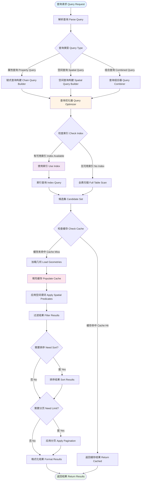

# 查询引擎流程 / Query Engine Flow



## 图表说明 Description

### 中文说明

查询引擎是 WebGeoDB 的核心功能模块，负责处理所有查询请求并返回结果：

#### 查询处理阶段

1. **查询解析**: 解析查询请求，识别查询类型
   - 属性查询: 基于属性字段的条件查询
   - 空间查询: 基于几何关系的空间查询
   - 组合查询: 属性和空间条件的组合

2. **查询优化**: 分析查询并选择最优执行计划
   - 评估可用索引
   - 选择最优索引策略
   - 优化查询顺序

3. **索引利用**: 使用空间索引加速查询
   - R-Tree索引: 适合动态数据
   - 静态索引: 适合静态数据
   - 混合索引: 平衡性能和灵活性

4. **缓存管理**: 减少重复计算
   - 检查缓存是否命中
   - 填充缓存供后续使用
   - LRU淘汰策略

5. **谓词应用**: 应用空间谓词过滤
   - OGC标准空间谓词
   - 优化版本提升性能
   - 精确几何计算

6. **结果处理**: 排序、分页、格式化
   - 多字段排序支持
   - 灵活的分页机制
   - 标准化输出格式

### English Description

The query engine is WebGeoDB's core functional module responsible for processing all query requests and returning results:

#### Query Processing Stages

1. **Query Parsing**: Parse query request, identify query type
   - Property Query: Condition-based queries on property fields
   - Spatial Query: Geometry relation-based spatial queries
   - Combined Query: Combination of property and spatial conditions

2. **Query Optimization**: Analyze query and select optimal execution plan
   - Evaluate available indexes
   - Select optimal index strategy
   - Optimize query order

3. **Index Utilization**: Use spatial indexes to accelerate queries
   - R-Tree Index: Suitable for dynamic data
   - Static Index: Suitable for static data
   - Hybrid Index: Balance performance and flexibility

4. **Cache Management**: Reduce redundant calculations
   - Check if cache hits
   - Populate cache for subsequent use
   - LRU eviction strategy

5. **Predicate Application**: Apply spatial predicates for filtering
   - OGC standard spatial predicates
   - Optimized versions for performance
   - Precise geometric calculations

6. **Result Processing**: Sort, paginate, format
   - Multi-field sort support
   - Flexible pagination mechanism
   - Standardized output format

## 查询优化技巧 Query Optimization Tips

### 1. 使用索引 Use Indexes
```typescript
// 创建索引
await db.features.createIndex('geometry', 'rtree')

// 查询会自动使用索引
const results = await db.features
  .distance('geometry', [116.4, 39.9], '<', 1000)
  .toArray()
```

### 2. 合理使用缓存 Use Cache Effectively
```typescript
// 预热缓存
await db.features.loadGeometries(ids)

// 后续查询会命中缓存
const cached = await db.features.findById(id)
```

### 3. 限制结果集 Limit Result Set
```typescript
// 始终使用limit
const results = await db.features
  .where('type', '=', 'poi')
  .limit(100)  // 限制结果数量
  .toArray()
```

### 4. 选择合适的查询顺序 Choose Optimal Query Order
```typescript
// 先过滤后计算
const results = await db.features
  .where('type', '=', 'poi')        // 先属性过滤
  .where('rating', '>', 4)          // 继续过滤
  .distance('geometry', center, '<', 1000)  // 最后空间查询
  .toArray()
```
