# CRUD 操作数据流 / CRUD Operations Data Flow

```mermaid
flowchart TB
    subgraph "CREATE 插入操作"
        C_START([插入请求 Insert Request]) --> C_VALIDATE[数据验证 Data Validation]
        C_VALIDATE --> C_CHECK{验证通过? Valid?}
        C_CHECK -->|否 No| C_ERROR([返回错误 Return Error])
        C_CHECK -->|是 Yes| C_CACHE[写入缓存 Write to Cache]
        C_CACHE --> C_INDEX[更新索引 Update Index]
        C_INDEX --> C_IDB[写入IndexedDB Write to IndexedDB]
        C_IDB --> C_TRANS{事务成功? Transaction OK?}
        C_TRANS -->|否 No| C_ROLL[回滚操作 Rollback]
        C_TRANS -->|是 Yes| C_SUCCESS([返回成功 Return Success])
        C_ROLL --> C_ERROR
    end

    subgraph "READ 查询操作"
        R_START([查询请求 Query Request]) --> R_CHECK_CACHE{检查缓存 Check Cache}
        R_CHECK_CACHE -->|命中 Hit| R_RETURN_CACHE([返回缓存结果 Return Cached])
        R_CHECK_CACHE -->|未命中 Miss| R_INDEX{使用索引? Use Index?}
        R_INDEX -->|是 Yes| R_INDEX_QUERY[索引查询 Index Query]
        R_INDEX -->|否 No| R_FULL_SCAN[全表扫描 Full Scan]
        R_INDEX_QUERY --> R_CANDIDATES[候选集 Candidates]
        R_FULL_SCAN --> R_CANDIDATES
        R_CANDIDATES --> R_LOAD[加载几何 Load Geometries]
        R_LOAD --> R_FILTER[应用谓词 Apply Predicates]
        R_FILTER --> R_CACHE_FILL[填充缓存 Fill Cache]
        R_CACHE_FILL --> R_RETURN([返回结果 Return Results])
    end

    subgraph "UPDATE 更新操作"
        U_START([更新请求 Update Request]) --> U_VALIDATE[数据验证 Data Validation]
        U_VALIDATE --> U_CHECK{验证通过? Valid?}
        U_CHECK -->|否 No| U_ERROR([返回错误 Return Error])
        U_CHECK -->|是 Yes| U_OLD_CACHE[更新缓存 Update Cache]
        U_OLD_CACHE --> U_OLD_INDEX[更新索引 Update Index]
        U_OLD_INDEX --> U_IDB[更新IndexedDB Update IndexedDB]
        U_IDB --> U_TRANS{事务成功? Transaction OK?}
        U_TRANS -->|否 No| U_ROLL[回滚操作 Rollback]
        U_TRANS -->|是 Yes| U_SUCCESS([返回成功 Return Success])
        U_ROLL --> U_ERROR
    end

    subgraph "DELETE 删除操作"
        D_START([删除请求 Delete Request]) --> D_VALIDATE[验证ID Validate ID]
        D_VALIDATE --> D_CHECK{ID存在? Exists?}
        D_CHECK -->|否 No| D_ERROR([返回错误 Return Error])
        D_CHECK -->|是 Yes| D_CACHE[清理缓存 Clear Cache]
        D_CACHE --> D_INDEX[清理索引 Clear Index]
        D_INDEX --> D_IDB[删除IndexedDB Delete from IndexedDB]
        D_IDB --> D_TRANS{事务成功? Transaction OK?}
        D_TRANS -->|否 No| D_ROLL[回滚操作 Rollback]
        D_TRANS -->|是 Yes| D_SUCCESS([返回成功 Return Success])
        D_ROLL --> D_ERROR
    end

    style C_START fill:#e8f5e9
    style R_START fill:#e1f5ff
    style U_START fill:#fff4e6
    style D_START fill:#fce4ec
    style C_SUCCESS fill:#c8e6c9
    style R_RETURN fill:#bbdefb
    style U_SUCCESS fill:#ffe0b2
    style D_SUCCESS fill:#f8bbd9
    style C_ERROR fill:#ffcdd2
    style U_ERROR fill:#ffcdd2
    style D_ERROR fill:#ffcdd2
```



## 图表说明 Description

### 中文说明

CRUD操作是数据库最基础的功能，本图展示了WebGeoDB中四种基本操作的完整数据流：

#### CREATE (创建/插入)
1. **数据验证**: 验证输入数据的完整性和合法性
2. **写入缓存**: 将几何数据写入LRU缓存
3. **更新索引**: 更新所有相关空间索引
4. **持久化**: 将数据写入IndexedDB
5. **事务管理**: 确保操作的原子性，失败时回滚

#### READ (读取/查询)
1. **缓存检查**: 优先从缓存读取数据
2. **索引查询**: 使用空间索引快速定位候选集
3. **数据加载**: 从IndexedDB加载完整数据
4. **谓词过滤**: 应用空间谓词精确过滤
5. **缓存填充**: 将结果填充到缓存供后续使用

#### UPDATE (更新)
1. **数据验证**: 验证更新数据的合法性
2. **缓存更新**: 更新或删除缓存中的旧数据
3. **索引重建**: 更新空间索引以反映新数据
4. **持久化更新**: 在IndexedDB中更新数据
5. **事务管理**: 确保更新操作的一致性

#### DELETE (删除)
1. **ID验证**: 验证要删除的记录是否存在
2. **缓存清理**: 从缓存中删除相关数据
3. **索引清理**: 从空间索引中删除条目
4. **持久化删除**: 从IndexedDB删除数据
5. **事务管理**: 确保删除操作的一致性

### English Description

CRUD operations are the most basic functions of a database. This diagram shows the complete data flow of four basic operations in WebGeoDB:

#### CREATE
1. **Data Validation**: Validate input data integrity and legitimacy
2. **Write to Cache**: Write geometry data to LRU cache
3. **Update Index**: Update all related spatial indexes
4. **Persist**: Write data to IndexedDB
5. **Transaction Management**: Ensure operation atomicity, rollback on failure

#### READ
1. **Cache Check**: Prioritize reading data from cache
2. **Index Query**: Use spatial index to quickly locate candidate set
3. **Data Load**: Load complete data from IndexedDB
4. **Predicate Filter**: Apply spatial predicates for precise filtering
5. **Cache Fill**: Populate results to cache for subsequent use

#### UPDATE
1. **Data Validation**: Validate update data legitimacy
2. **Cache Update**: Update or delete old data in cache
3. **Index Rebuild**: Update spatial index to reflect new data
4. **Persist Update**: Update data in IndexedDB
5. **Transaction Management**: Ensure update operation consistency

#### DELETE
1. **ID Validation**: Validate if record to delete exists
2. **Cache Clear**: Delete related data from cache
3. **Index Clear**: Delete entries from spatial index
4. **Persist Delete**: Delete data from IndexedDB
5. **Transaction Management**: Ensure delete operation consistency

## 最佳实践 Best Practices

### 1. 批量操作 Use Batch Operations
```typescript
// ❌ 不好：多次单条插入
for (const feature of features) {
  await db.features.insert(feature)
}

// ✅ 好：批量插入
await db.features.insertMany(features)
```

### 2. 事务控制 Transaction Control
```typescript
// 使用事务确保一致性
await db.transaction('rw', db.features, async () => {
  await db.features.insert(feature1)
  await db.features.insert(feature2)
  // 两个操作要么都成功，要么都失败
})
```

### 3. 错误处理 Error Handling
```typescript
try {
  await db.features.insert(feature)
} catch (error) {
  // 处理验证错误、事务错误等
  console.error('Insert failed:', error)
}
```

### 4. 缓存预热 Cache Warming
```typescript
// 预加载常用数据到缓存
const frequentlyUsed = await db.features
  .where('type', '=', 'poi')
  .limit(100)
  .toArray()

// 后续查询会命中缓存
```
