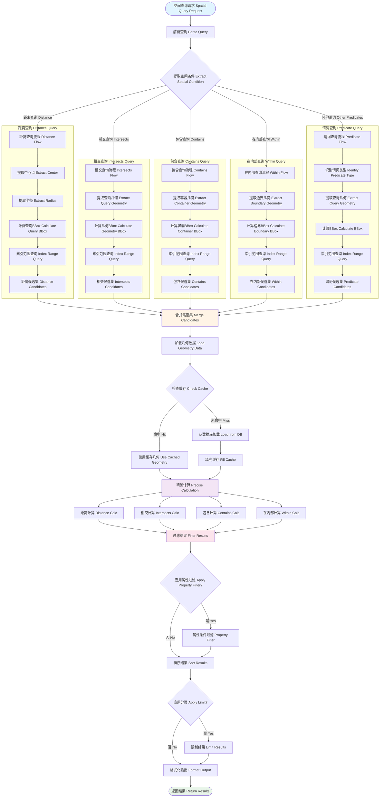

# 空间查询执行流程 / Spatial Query Execution Flow



## 图表说明 Description

### 中文说明

空间查询是WebGeoDB的核心功能，本图展示了空间查询的完整执行流程：

#### 查询类型

1. **距离查询 (Distance)**: 查找指定半径内的地理对象
   - 提取中心点和半径
   - 计算查询边界框
   - 使用索引快速过滤

2. **相交查询 (Intersects)**: 查找与指定几何相交的对象
   - 提取查询几何
   - 计算几何边界框
   - 索引范围查询

3. **包含查询 (Contains)**: 查找完全包含指定几何的对象
   - 提取容器几何
   - 索引和精确验证

4. **在内部查询 (Within)**: 查找完全在指定几何内部的对象
   - 提取边界几何
   - 方向相反的包含判断

#### 执行阶段

1. **索引过滤**: 使用R-Tree索引快速缩小候选集
2. **候选集合并**: 合并多个空间条件的候选集
3. **精确计算**: 对候选集进行精确的几何计算
4. **缓存利用**: 缓存几何对象减少重复加载
5. **结果过滤**: 应用属性条件和排序分页

### English Description

Spatial query is the core function of WebGeoDB. This diagram shows the complete execution flow of spatial queries:

#### Query Types

1. **Distance Query**: Find geographic objects within specified radius
   - Extract center point and radius
   - Calculate query bounding box
   - Use index for fast filtering

2. **Intersects Query**: Find objects intersecting with specified geometry
   - Extract query geometry
   - Calculate geometry bounding box
   - Index range query

3. **Contains Query**: Find objects completely containing specified geometry
   - Extract container geometry
   - Index and precise verification

4. **Within Query**: Find objects completely within specified geometry
   - Extract boundary geometry
   - Reverse direction of contains judgment

#### Execution Stages

1. **Index Filter**: Use R-Tree index to quickly narrow candidate set
2. **Candidate Merge**: Merge candidate sets from multiple spatial conditions
3. **Precise Calculation**: Perform precise geometry calculations on candidate set
4. **Cache Utilization**: Cache geometry objects to reduce redundant loading
5. **Result Filter**: Apply property conditions and sorting pagination

## 性能优化要点 Performance Optimization Points

### 1. 索引优先 Index First
```typescript
// ✅ 创建空间索引
await db.features.createIndex('geometry', 'rtree')

// 查询会自动使用索引
const results = await db.features
  .intersects('geometry', queryPolygon)
  .toArray()
```

### 2. BBox预过滤 BBox Pre-filtering
```typescript
// 先用BBox快速过滤
const bbox = turf.bbox(queryPolygon)
const candidates = await db.features
  .where('geometry', 'within', bbox)
  .toArray()

// 再精确计算
const results = candidates.filter(f =>
  turf.intersects(f.geometry, queryPolygon)
)
```

### 3. 批量查询优化 Batch Query Optimization
```typescript
// 批量距离查询
const points = await db.features.toArray()
const distances = await Promise.all(
  points.map(p => db.distance(p.geometry, center))
)
```

### 4. 缓存预热 Cache Warming
```typescript
// 预加载区域数据到缓存
const areaData = await db.features
  .within('geometry', area)
  .toArray()

// 后续查询会更快
```
