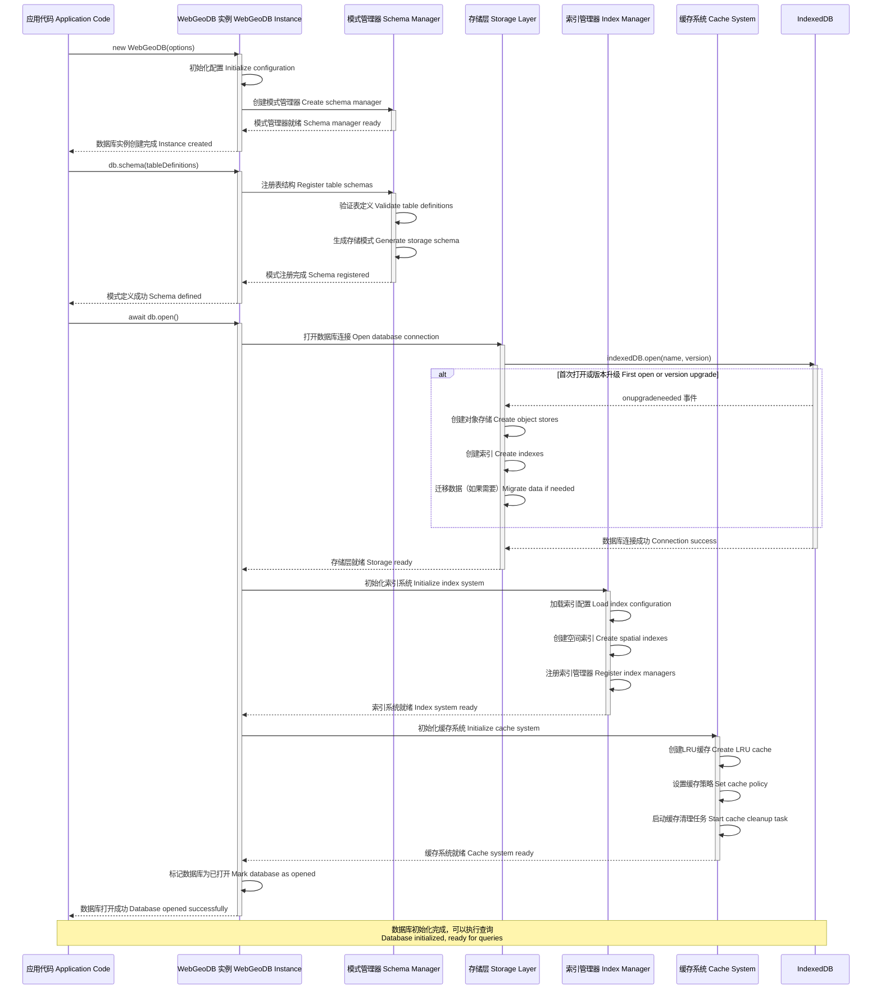

# 数据库初始化时序图 / Database Initialization Sequence Diagram



## 图表说明 Description

### 中文说明

本时序图展示了 WebGeoDB 数据库的完整初始化流程：

#### 初始化阶段

1. **实例创建 (new WebGeoDB)**
   - 创建数据库实例
   - 初始化内部配置
   - 创建模式管理器

2. **模式定义 (schema)**
   - 注册表结构定义
   - 验证表定义的合法性
   - 生成 IndexedDB 存储模式

3. **数据库打开 (open)**
   - 打开 IndexedDB 连接
   - 处理版本升级（如果需要）
   - 创建对象存储和索引
   - 初始化索引系统
   - 初始化缓存系统

#### 关键组件

- **模式管理器**: 管理表结构和字段定义
- **存储层**: 封装 IndexedDB 操作
- **索引管理器**: 管理空间索引的创建和维护
- **缓存系统**: 提供 LRU 缓存功能

### English Description

This sequence diagram shows the complete initialization flow of WebGeoDB database:

#### Initialization Stages

1. **Instance Creation (new WebGeoDB)**
   - Create database instance
   - Initialize internal configuration
   - Create schema manager

2. **Schema Definition (schema)**
   - Register table structure definitions
   - Validate table definitions
   - Generate IndexedDB storage schema

3. **Database Open (open)**
   - Open IndexedDB connection
   - Handle version upgrade (if needed)
   - Create object stores and indexes
   - Initialize index system
   - Initialize cache system

#### Key Components

- **Schema Manager**: Manages table structures and field definitions
- **Storage Layer**: Encapsulates IndexedDB operations
- **Index Manager**: Manages creation and maintenance of spatial indexes
- **Cache System**: Provides LRU cache functionality

## 初始化代码示例 Initialization Code Example

### 完整初始化流程 Complete Initialization Flow
```typescript
// 1. 创建实例
const db = new WebGeoDB({
  name: 'my-geo-database',
  version: 1
})

// 2. 定义模式
db.schema({
  features: {
    id: 'string',
    name: 'string',
    type: 'string',
    geometry: 'geometry',
    properties: 'json'
  },
  locations: {
    id: 'string',
    timestamp: 'number',
    coordinates: 'geometry'
  }
})

// 3. 打开数据库
try {
  await db.open()
  console.log('Database initialized successfully')
} catch (error) {
  console.error('Failed to initialize database:', error)
}
```

### 版本升级处理 Version Upgrade Handling
```typescript
// 版本升级时自动迁移数据
db.schema({
  features: {
    id: 'string',
    name: 'string',
    type: 'string',
    geometry: 'geometry',
    properties: 'json',
    // 新增字段
    createdAt: 'number',
    updatedAt: 'number'
  }
})

// 增加版本号
const db = new WebGeoDB({
  name: 'my-geo-database',
  version: 2  // 版本升级
})
```

## 最佳实践 Best Practices

1. **错误处理**: 始终使用 try-catch 包裹初始化代码
2. **版本管理**: 升级模式时增加版本号
3. **懒加载**: 只在需要时打开数据库
4. **资源清理**: 使用完毕后关闭数据库连接
