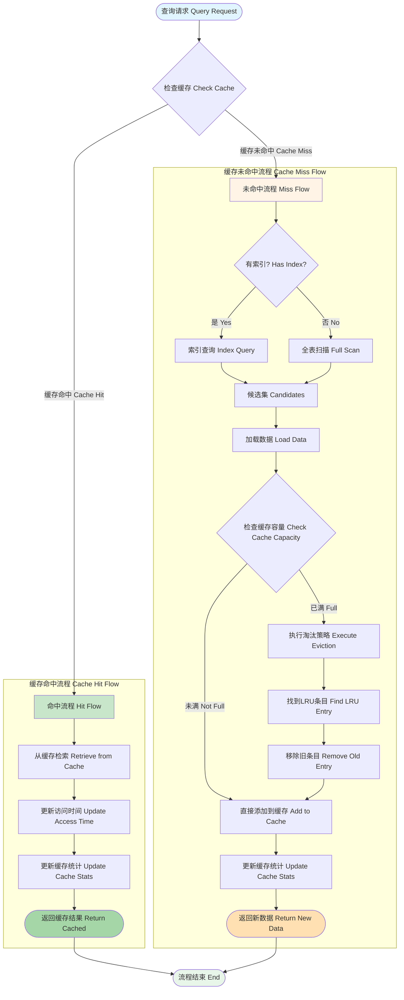

# 缓存命中/未命中流程 / Cache Hit/Miss Flow



## 图表说明 Description

### 中文说明

本图展示了 WebGeoDB 缓存系统的完整工作流程，包括缓存命中和未命中两种情况的处理逻辑：

#### 缓存命中流程 (Cache Hit)

1. **检索缓存**: 从LRU缓存中快速获取数据
2. **更新访问时间**: 更新该条目的最后访问时间，防止被淘汰
3. **更新统计**: 增加缓存命中次数，用于计算命中率
4. **返回结果**: 直接返回缓存数据，无需访问数据库

**优势**: 极快的响应速度（微秒级），减少数据库访问

#### 缓存未命中流程 (Cache Miss)

1. **索引查询**: 使用空间索引快速定位候选数据
2. **数据加载**: 从IndexedDB加载完整数据
3. **容量检查**: 检查缓存是否已达到最大容量
4. **直接添加**: 如果缓存未满，直接添加新数据
5. **LRU淘汰**: 如果缓存已满，执行LRU淘汰策略
   - 找到最久未使用的条目
   - 移除该条目
   - 添加新数据
6. **更新统计**: 增加缓存未命中次数

**优势**: 自动管理缓存大小，保留热点数据

### 缓存策略配置 Cache Policy Configuration

```typescript
// 配置缓存策略
const db = new WebGeoDB({
  name: 'my-db',
  cache: {
    maxSize: 1000,        // 最大缓存条目数
    ttl: 30 * 60 * 1000,  // 缓存生存时间（30分钟）
    strategy: 'lru'       // 淘汰策略：LRU
  }
})
```

### 缓存统计监控 Cache Statistics Monitoring

```typescript
// 获取缓存统计信息
const stats = await db.getCacheStats()
console.log('缓存命中率:', stats.hitRate)
console.log('缓存大小:', stats.size)
console.log('总请求数:', stats.totalRequests)

// 示例输出
// {
//   hitRate: 0.85,      // 85% 命中率
//   size: 847,          // 当前缓存条目数
//   totalRequests: 1000,
//   hits: 850,
//   misses: 150
// }
```

### English Description

This diagram shows the complete workflow of WebGeoDB cache system, including both cache hit and miss handling logic:

#### Cache Hit Flow

1. **Retrieve Cache**: Quickly get data from LRU cache
2. **Update Access Time**: Update last access time to prevent eviction
3. **Update Statistics**: Increment cache hit count for hit rate calculation
4. **Return Result**: Return cached data directly without database access

**Advantage**: Extremely fast response (microsecond level), reduce database access

#### Cache Miss Flow

1. **Index Query**: Use spatial index to quickly locate candidate data
2. **Data Load**: Load complete data from IndexedDB
3. **Capacity Check**: Check if cache has reached maximum capacity
4. **Direct Add**: If cache not full, directly add new data
5. **LRU Eviction**: If cache full, execute LRU eviction strategy
   - Find least recently used entry
   - Remove that entry
   - Add new data
6. **Update Statistics**: Increment cache miss count

**Advantage**: Automatically manage cache size, retain hot data

## 缓存优化技巧 Cache Optimization Tips

### 1. 预热缓存 Cache Warming
```typescript
// 应用启动时预热常用数据
async function warmupCache() {
  const hotData = await db.features
    .where('type', '=', 'poi')
    .limit(100)
    .toArray()

  console.log('Cache warmed with', hotData.length, 'items')
}
```

### 2. 缓存清理 Cache Cleanup
```typescript
// 手动清理缓存
await db.clearCache()

// 或者清理特定条目
await db.invalidateCache('feature-id-123')
```

### 3. 缓存大小调优 Cache Size Tuning
```typescript
// 根据内存情况调整缓存大小
const cacheSize = navigator.deviceMemory >= 8 ? 2000 : 500

const db = new WebGeoDB({
  name: 'my-db',
  cache: {
    maxSize: cacheSize  // 动态调整
  }
})
```

### 4. 监控缓存命中率 Monitor Cache Hit Rate
```typescript
// 定期检查缓存性能
setInterval(async () => {
  const stats = await db.getCacheStats()
  if (stats.hitRate < 0.7) {
    console.warn('Cache hit rate low:', stats.hitRate)
    // 考虑增加缓存大小或优化查询
  }
}, 60000)  // 每分钟检查
```
