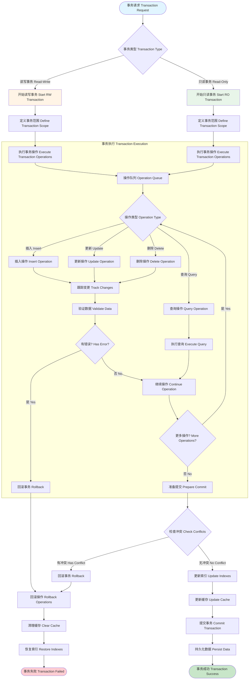

# 事务处理流程 / Transaction Processing Flow



## 图表说明 Description

### 中文说明

本图展示了 WebGeoDB 事务处理的完整流程，包括事务的开始、执行、提交和回滚：

#### 事务类型

1. **读写事务 (Read-Write)**
   - 允许插入、更新、删除操作
   - 需要独占访问相关表
   - 支持完整的事务隔离

2. **只读事务 (Read-Only)**
   - 只允许查询操作
   - 可以并发执行
   - 更快的执行速度

#### 事务执行阶段

1. **定义范围**: 指定事务涉及的表
2. **操作队列**: 收集所有数据库操作
3. **数据验证**: 验证操作的有效性
4. **冲突检测**: 检查是否有冲突操作
5. **索引更新**: 更新所有相关索引
6. **缓存更新**: 更新或清理缓存
7. **数据持久化**: 提交到 IndexedDB

#### 事务回滚

当遇到错误或冲突时：
1. **回滚操作**: 撤销所有已执行的操作
2. **清理缓存**: 清理相关的缓存数据
3. **恢复索引**: 恢复索引到之前的状态
4. **返回错误**: 向调用者报告失败

### English Description

This diagram shows the complete transaction processing flow in WebGeoDB, including transaction start, execution, commit, and rollback:

#### Transaction Types

1. **Read-Write Transaction**
   - Allows insert, update, delete operations
   - Requires exclusive access to related tables
   - Supports full transaction isolation

2. **Read-Only Transaction**
   - Only allows query operations
   - Can execute concurrently
   - Faster execution speed

#### Transaction Execution Stages

1. **Define Scope**: Specify tables involved in transaction
2. **Operation Queue**: Collect all database operations
3. **Data Validation**: Validate operation validity
4. **Conflict Detection**: Check for conflicting operations
5. **Index Update**: Update all related indexes
6. **Cache Update**: Update or clear cache
7. **Data Persistence**: Commit to IndexedDB

#### Transaction Rollback

When encountering errors or conflicts:
1. **Rollback Operations**: Undo all executed operations
2. **Clear Cache**: Clear related cache data
3. **Restore Indexes**: Restore indexes to previous state
4. **Return Error**: Report failure to caller

## 事务使用示例 Transaction Usage Examples

### 1. 基本事务 Basic Transaction
```typescript
// 读写事务
await db.transaction('rw', db.features, async () => {
  // 所有操作在同一个事务中
  await db.features.insert(feature1)
  await db.features.insert(feature2)
  await db.features.update(id3, updates)

  // 任何错误都会导致回滚
})

// 只读事务
const results = await db.transaction('r', db.features, async () => {
  return await db.features.where('type', '=', 'poi').toArray()
})
```

### 2. 跨表事务 Cross-Table Transaction
```typescript
// 涉及多个表的事务
await db.transaction(
  'rw',
  [db.features, db.locations, db.metadata],
  async () => {
    await db.features.insert(feature)
    await db.locations.insert(location)
    await db.metadata.update('count', { value: count + 1 })

    // 全部成功或全部回滚
  }
)
```

### 3. 错误处理 Error Handling
```typescript
try {
  await db.transaction('rw', db.features, async () => {
    await db.features.insert(feature1)
    await db.features.insert(feature2)

    // 如果这里抛出错误，上面两个插入都会回滚
    throw new Error('Something went wrong')
  })
} catch (error) {
  console.error('Transaction failed, all changes rolled back:', error)
}
```

### 4. 嵌套事务 Nested Transactions
```typescript
// 外层事务
await db.transaction('rw', db.features, async () => {
  await db.features.insert(feature1)

  // 内层事务（实际上是同一个事务）
  await db.transaction('rw', db.locations, async () => {
    await db.locations.insert(location1)
  })

  // 所有操作在同一个事务中
})
```

## 事务最佳实践 Transaction Best Practices

1. **保持简短**: 事务应该尽可能简短，减少锁定时间
2. **错误处理**: 始终使用 try-catch 处理事务错误
3. **避免嵌套**: 尽量避免深层嵌套事务
4. **只读优化**: 查询操作使用只读事务提升性能
5. **批量操作**: 将相关操作放在同一事务中
